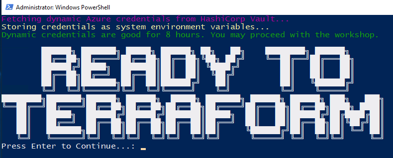
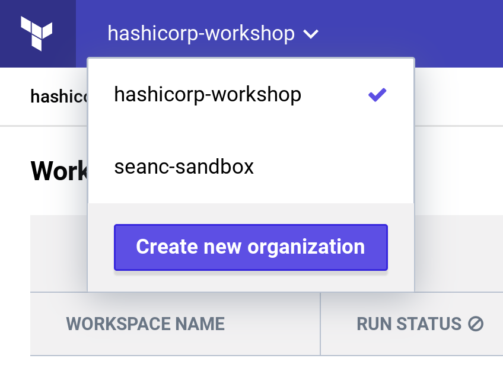
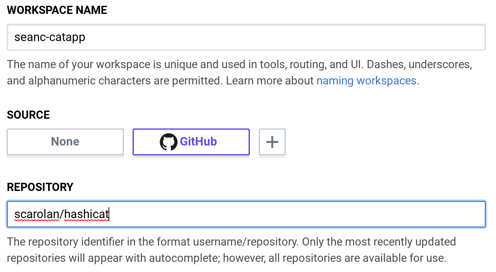
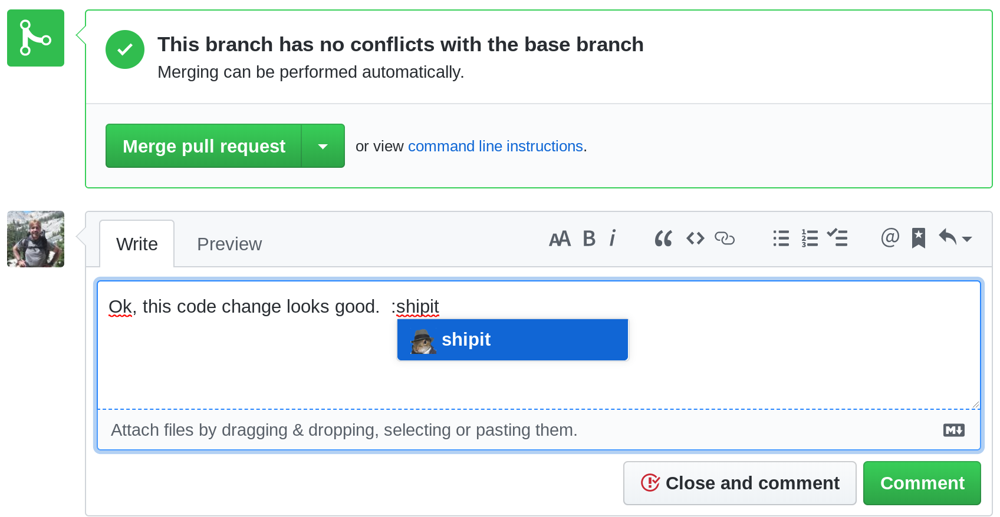
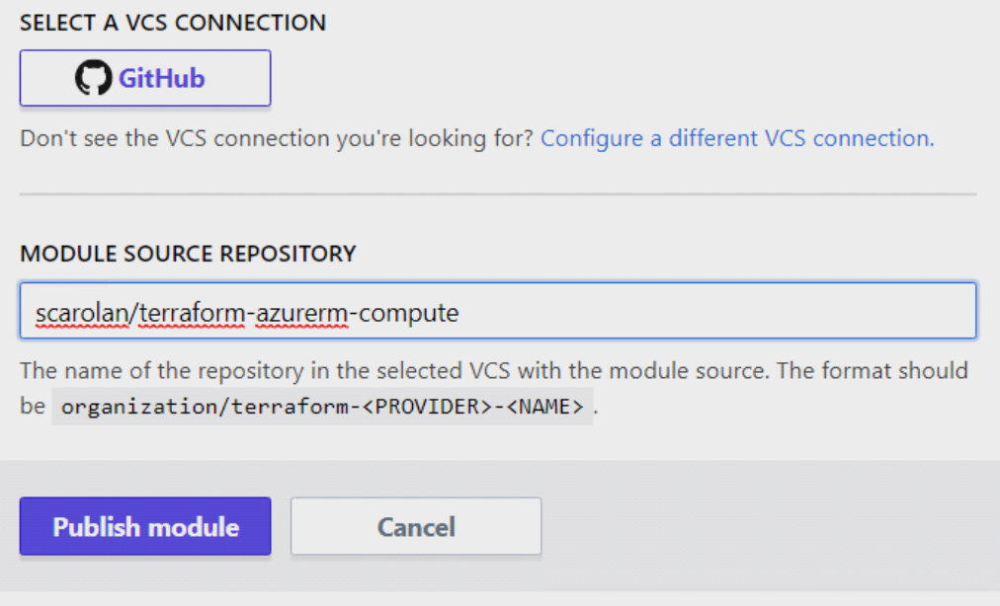

name: Azure-Terraform-Vault-Workshop
class: center,middle,title-slide
count: false

.titletext[
Azure Terraform Workshop]
Build Azure Resources With Infrastructure as Code

???
<!---
Azure Terraform Vault Workshop - Part 1
Terraform for Beginners on Azure

This slide presentation is stored as Markdown code, specifically using the RemarkJS engine to render it. All standard markdown tags are supported, and you can also use some HTML within this document. 

If you need to change the look and feel of the slide deck just use the style.css and remark_settings.js files to suit your needs. The content in this file is picked up by index.html when the page is loaded.

HTML comments like this one will show up in the source code, but not in the slides or speaker notes.
--->

Welcome to the beginner's guide to Terraform on Azure. This slide deck is written entirely in Markdown language, which means you can make edits or additions, then submit a pull request to add your changes to the master copy. To make edits to the slide deck simply fork this repository:  

https://github.com/hashicorp/se-terraform-vault-workshop  

edit the Markdown files, and submit a pull request with your changes.

The Markdown content is contained in the docs/terraform and docs/vault directories.

Here are some helpful keyboard shortcuts for the instructor or participant:  

⬆ ⬇ ⬅ ➡ - Navigate back and forth  
P         - Toggle presenter view  
C         - Pop an external window for presentation

Instructor notes are included in plain text, narrative parts are in **bold**. You can use the narrative quotes or change them to suit your own presentation style. 

---
name: Link-to-Slide-Deck
The Slide Deck
-------------------------
<br><br><br>
.center[
Follow along on your own computer at this link:

https://bit.ly/hashiazure
=========================
]

---
name: Introductions
Introductions
-------------------------
<br><br><br>
.contents[
* Your Name
* Job Title
* Automation Experience
* Favorite Text Editor
]

???
Use this slide to introduce yourself, give a little bit of your background story, then go around the room and have all your participants introduce themselves.

The favorite text editor question is a good ice breaker, but perhaps more importantly it gives you an immediate gauge of how technical your users are.  

**There are no wrong answers to this question. Unless you say Notepad. Friends don't let friends write code in Notepad.**

**If you don't have a favorite text editor, that's okay! We've brought prebuilt cloud workstations that have Visual Studio Code already preinstalled. VSC is a free programmer's text editor for Microsoft, and it has great Terraform support. Most of this workshop will be simply copying and pasting code, so if you're not a developer don't fret. Terraform is easy to learn and fun to work with.**

---
name: Table-of-Contents
class: center,middle
Table of Contents
=========================

.contents[
0. Intro to Terraform & Demo
1. Set Up Your Workstation
2. My First Terraform
3. Terraform In Action: plan, apply, destroy
4. Organizing Your Terraform Code
5. Provision and Configure Azure VMs
6. Manage and Change Infrastructure State
]

???
This workshop should take roughly three hours to complete. It is ideal for a half-day workshop and can be paired with Vault content for a full day of training. The infrastructure participants build during the morning session is used as the lab environment for the afternoon session. So you can do a half day of Terraform and/or Vault, or both of them together.

**Here is our agenda for today's training. We'll be taking breaks after each major section or every hour, whichever comes first. This part of the workshop will take us through lunch break, then we'll cover Vault during the afternoon session.**

---
name: How-to-Provision-a-VM
How to Provision an Azure VM
-------------------------
<br><br><br>

Let's look at a few different ways you could provision a new Azure Virtual Machine. Before we start we'll need to gather some basic information including:

.biglist[
1. Virtual Machine Name
1. Operating System (Image)
1. VM Size
1. Geographical Location
1. Username and Password
]

???
**Has anyone got experience using Azure? How do most of us normally get started? That's right, we log onto the Azure Portal and start clicking around. All of the major cloud providers make this part really easy. You get your account, log on and start clicking buttons. Let's take a peek at what that looks like...**

---
name: Azure-Portal-Provision
Method 1: Azure Portal (GUI)
-------------------------


???
**This should look familiar if you've ever used Azure. You click on Virtual Machines, and you'll see a whole list of different base images you can use to provision your VM. Some of these are provided by Microsoft, others are provided by third parties in the marketplace. You either search or browse for the thing you need, and click on it. Easy.**

---
name: Azure-Portal-Provision-2
Method 1: Azure Portal (GUI)
-------------------------


???
**Once you've chosen your base OS image, you will fill in some more details like the size of the VM, which location you want to run it in, and the initial administrator password. The Azure portal can be handy for spinning up individual VMs and dev or test environments. The good news is it's really easy to spin up infrastructure this way. The bad news is that it doesn't scale, and chances are nobody's keeping track of what got built.**

---
name: Azure-Resource-Manager
Method 2: Azure Resource Manager (ARM) Template
-------------------------
```json
{
...
"apiVersion": "2017-03-30",
"type": "Microsoft.Compute/virtualMachines",
"name": "[variables('vmName')]",
"location": "[parameters('location')]",
"dependsOn": [
  "[concat('Microsoft.Network/networkInterfaces/', variables('nicName'))]"
],
"properties": {
  "hardwareProfile": {
    "vmSize": "[parameters('virtualMachineSize')]"
  },
  "osProfile": {
    "computerName": "[variables('vmName')]",
    "adminUsername": "[parameters('adminUsername')]",
    "adminPassword": "[parameters('adminPassword')]"
  }
```

ARM templates provide a consistent and reliable way to provision Azure resources. JSON is easy for computers to read, but can be challenging for humans to edit and troubleshoot.

???
**Which brings us to method #2, Azure Resource Manager templates, also known as ARM templates. Have any of you used ARM templates? What's that experience like?**

**ARM templates are written in JSON, which stands for JavaScript Object Notation. It is an open-standard format for transmitting data between computers. And don't get me wrong, JSON is great. If you happen to be a computer. Computers are really good at reading these files full of key-value pairs and lists.**

**The problem is that editing and maintaining huge JSON files is hard for humans. Because JSON is not a programming language, you'll end up writing a lot more lines of complex code that is hard to understand and change.**

**ARM templates - easy for computers to read, hard for humans to troubleshoot and maintain.**

---
name: Provision-with-Terraform-2
Method 3: Provision with Terraform
-------------------------
<br><br><br>
```terraform
resource "azure_virtual_machine" "web" {
  name     = "MyFirstVM"
  image    = "Windows 2012 R2"
  vm_size  = "Standard DS1"
  location = "East US"
  username = "John Doe"
  password = "YoullNeverGuessThisPassword"
}
```
.center[Example terraform code for building an Azure VM.]

???
**And finally we have option #3, Terraform. Terraform uses a Domain Specific Language, or DSL that is designed to be both human-friendly and machine-readable. This is an example snippet of Terraform code. Now watch as I flip back to the previous slide. Would you rather have to write and maintain this complex and messy JSON, or this simple, compact terraform code?**

Advance back to the previous slide to illustrate the difference between JSON and equivalent Terraform. 

---
name: What-is-Terraform
What is Terraform?
-------------------------


.contents[
* Executable Documentation
* Human and machine readable
* Easy to learn
* Test, share, re-use, automate
* Works on all major cloud providers
]

???
**So what exactly _is_ Terraform? Terraform is the DNA of your hybrid infrastructure. Terraform code is written in HCL, or HashiCorp Config Language. It is the only programming language designed specifically for provisioning infrastructure on any platform.**

**Do any of you have a wiki or set of runbooks that contain provisioning instructions? Think for a moment about that wiki. Now I want you to imagine the date stamp, when was this thing last edited? Let's say it was four years ago. Do you think maybe something could have changed in the past four years?**

**It sounds funny but the truth is your wiki is the obituary of the last known state of your infrastructure. One of the main reasons to use terraform is because it is self-documenting. The code itself explains every step required to build this infrastructure, and therefore it is always up to date.**

---
name: IaC
What is Infrastructure as Code?
-------------------------
<br><br><br>
.biglist[
Infrastructure as Code (IaC) is the process of managing and provisioning cloud infrastructure with machine-readable definition files. 

**Think of it as executable documentation.**
]

???
**You might be thinking...why can't I just do this by hand? After all the Azure portal is really easy, and I can just stand up my infrastructure manually. Here's why:**

**Terraform ensures that when you build any type of infrastructure that it gets built correctly every single time, exactly the same way. Let's try a thought experiment. If I gave every single one of you the same build document and asked you to set up a server, I guarantee there will be differences in those machines when you hand them over. They may not be major differences, but over time these can pile up and cause all sorts of uncertainty and issues in your environment.**

**When you require hands on keyboards (or mice), and you start making changes and manual steps on your infrastructure, you've lost the automation battle before it even starts. Even a single manual step can slow down your delivery schedule, and introduce unnecessary risk and change to your environments.**

---
name: IaC2
Infrastructure as Code Allows Us To...
-------------------------
???
**We sometimes call this philosophy 'Infrastructure as Code', or the practice of expressing all of our provisioning steps as machine-readable code and variables. This is also known as the...**

---
name: IaC2
Infrastructure as Code Allows Us To...
-------------------------
<br><br>
.biglist[
* Provide a codified workflow to create infrastructure
]
???
**...codified workflow. When you code-ify all of your manual steps, you'll gain several advantages that allow you to provision faster, with more efficiency, while reducing risk.**


---
name: IaC2
Infrastructure as Code Allows Us To...
-------------------------
<br><br>
.biglist[
* Provide a codified workflow to create infrastructure
* Change and update existing infrastructure
]
???
**One of the main benefits of IaC is the ability to change and update what you built. There are many tools that allow you to provision infrastructure. This is sometimes called 'Day 0' of operations. The real challenge is managing Day N. What happens when you need to alter the infrastructure you built? Maybe you need to destroy or recreate part or all of it? Are you prepared to maintain and care for this infrastructure, without causing any downtime? Because Terraform is a _stateful_ tool, it can help you keep track of your infrastructure and change it with minimal impact.**

---
name: IaC2
Infrastructure as Code Allows Us To...
-------------------------
<br><br>
.biglist[
* Provide a codified workflow to create infrastructure
* Change and update existing infrastructure
* Safely test changes using **`terraform plan`** in dry run mode
]
???
**Do you remember that scene in the movie Jurassic Park, where Samuel L Jackson turns around and says 'hold onto your butts' as he pushes his untested code change into production? Every sysadmin has had that feeling at one time or another. I really hope this works...**

**What if instead we had a way to safely test every change that went into production with a dry run? What would actually happen if I ran this code right now? Terraform comes with a built in dry run mode that allows you to visualize exactly what would happen if you pushed the apply button right now. This is a valuable tool for sysadmins and operations teams who prize stability and uptime.**

**Unexpected changes in the terraform plan output can be investigated _before_ they go into production.**

---
name: IaC2
Infrastructure as Code Allows Us To...
-------------------------
<br><br>
.biglist[
* Provide a codified workflow to create infrastructure
* Change and update existing infrastructure
* Safely test changes using **`terraform plan`** in dry run mode
* Integrate with application code workflows (Git, Azure DevOps, CI/CD tools)
]

???
**Terraform allows you to automate manual processes and build continuous integration or continuous delivery pipelines. Imagine you had a pipeline for creating hardened machine images. Perhaps you have another pipeline for testing your infrastructure build process. These might be chained to other CI/CD application pipelines where the application is deployed into your tested, hardened infrastructure. Think of API driven infrastructure builds, written in a simple langage everybody can use and understand.**

---
name: IaC2
Infrastructure as Code Allows Us To...
-------------------------
<br><br>
.biglist[
* Provide a codified workflow to create infrastructure
* Change and update existing infrastructure
* Safely test changes using **`terraform plan`** in dry run mode
* Integrate with application code workflows (Git, Azure DevOps, CI/CD tools)
* Provide reusable modules for easy sharing and collaboration
]

???
**As you expand your terraform usage, you'll have certain patterns and pieces of your infrastructure that you'd like to re-use. Maybe you want your network security to be set up a certain way, every time. Or perhaps someone wrote a great Terraform config for your web application. Terraform supports custom modules, which are simply packages of pre-built Terraform code that others can use. You can use Terraform modules to avoid repetition, enforce security, and ensure that standards are followed.**

---
name: IaC2
Infrastructure as Code Allows Us To...
-------------------------
<br><br>
.biglist[
* Provide a codified workflow to create infrastructure
* Change and update existing infrastructure
* Safely test changes using **`terraform plan`** in dry run mode
* Integrate with application code workflows (Git, Azure DevOps, CI/CD tools)
* Provide reusable modules for easy sharing and collaboration
* Enforce security policy and organizational standards
]

???
**Terraform Enterprise also supports policy enforcement. You can create a list of dos and do-nots for your users and ensure that people don't build things they shouldn't, or introduce unnecessary risk into your environments. For example, you may have a policy that states that servers should not be exposed to the public internet. Because all your infrastructure is stored as code, you can quickly analyze that code to see if it's breaking any of the rules, preventing the bad behavior *before* the infrastructure gets built.**

---
name: IaC2
Infrastructure as Code Allows Us To...
-------------------------
<br><br>
.biglist[
* Provide a codified workflow to create infrastructure
* Change and update existing infrastructure
* Safely test changes using **`terraform plan`** in dry run mode
* Integrate with application code workflows (Git, Azure DevOps, CI/CD tools)
* Provide reusable modules for easy sharing and collaboration
* Enforce security policy and organizational standards
* Enable collaboration between different teams
]

???
**Now that all your infrastructure is stored in a source code repository, it's very easy for multiple users and teams to collaborate on it. Developer needs a new feature? He or she can easily adjust the source code and send the change back to the operations folks for review. Terraform is a universal language that is understood by both developers and operations teams.**

---
name: IaC-Tools
Other Infrastructure as Code Tools
-------------------------
<br><br>
.center[]

These tools work well for configuring the operating system and application. They are not purpose-built for provisioning cloud infrastructure and platform services.

???
**Some of you might be thinking, that sounds great but what about this other tool that I use? Why shouldn't I just use Ansible since we already have that? Or my people only do Powershell. These are all great tools. But none of them are specifically designed for provisioning tasks.**

**Chef, Puppet and Ansible all work great in the context of your operating system and applications. It's true that you can do some cloud provisioning with each of these tools, but none of them really work as well as Terraform. And conversely, HashiCorp doesn't have a configuration management tool. Terraform works great with all of these tools.**

---
name: Native-Tools
Native Cloud Provisioning Tools
-------------------------
<br><br><br>
.center[]

Each cloud has its own YAML or JSON based provisioning tool. 

Terraform can be used across *all* major cloud providers and VM hypervisors.

???
**Every major cloud provider has their own JSON or YAML based provisioning tool. But all of them are written in YAML or JSON. And if you learn one of these systems, guess what, the others are completely different. Now if you want to have a multi-cloud strategy you have to learn three separate provisioning systems. With Terraform you are using the same language, the same simple syntax on all three of these cloud providers.**

---
name: Config-Hell
.center[]
???
**This is a fun web comic. Those of you who have spent hours poking at a nested JSON template, trying to figure out which layer of curly braces you are in will understand this...**

---
Name: Terraform-vs-JSON
Terraform vs. JSON
-------------------------
<br><br><br>
ARM JSON:
```json
"name": "[concat(parameters('PilotServerName'), '3')]",
```

Terraform:
```hcl
name = "${var.PilotServerName}3"
```

Terraform code (HCL) is easy to learn and easy to read. It is also 50-70% more compact than an equivalent JSON configuration.

???
1Password did a great blog post illustrating the difference between AWS Cloudformation (JSON) and Terraform. 

https://blog.1password.com/terraforming-1password/

1Password were able to move their entire production infrastructure to Terraform in a few short weeks. Now they can tear down and completely rebuild their production environment in a matter of hours.

---
Name: Why-Terraform
Why Terraform?
-------------------------


???
**Microsoft has invested significant resources to ensure that Azure users have a first-class experience when using Terraform to provision on Azure. Your friendly Microsoft solutions architect is happy to support you if you choose to use Terraform, especially if you are adopting a multi-cloud strategy. Terraform is even built right into Azure CloudShell. You can use Terraform with zero setup, right from your web browser.**

---
Name: Why-Terraform-on-Azure
Why Terraform on Azure?
-------------------------

.contents[
* Supports multi-cloud & hybrid infrastructure
]

???
**Why specifcially should you use Terraform on Azure? The first reason is that Terraform supports your hybrid or multi-cloud strategy. If you need to build some infrastructure on-prem, and some in Azure, Terraform is a natural fit. Your technical staff only has to learn a single language to be able to provision in either environment.**

---
Name: Why-Terraform-on-Azure
Why Terraform on Azure?
-------------------------

.contents[
* Supports multi-cloud & hybrid infrastructure
* Migrate from other cloud providers
]

???
**Terraform is also great for migrating between cloud providers. Let's say you wanted to move some workloads from AWS to Azure. The code changes in Terraform would be much easier to implement than they would via ARM templates. I was able to migrate a simple demo application from one cloud to another in a few short hours, because there was almost no learning curve. Terraform code looks the same no matter where you run it.**

---
Name: Why-Terraform-on-Azure
Why Terraform on Azure?
-------------------------

.contents[
* Supports multi-cloud & hybrid infrastructure
* Migrate from other cloud providers
* Increase provisioning speed
]

???
**It's not unusual to see provisioning times drop from days or weeks to hours or minutes when users adopt Terraform. Ineffective manual steps and change approvals can be replaced with fast code pipelines that have rigorous testing and security built right in. Now instead of waiting for days for a change request to be approved, users can self-provision their infrastructure without bottlenecks or slow approval processes.**

---
Name: Why-Terraform-on-Azure
Why Terraform on Azure?
-------------------------

.contents[
* Supports multi-cloud & hybrid infrastructure
* Migrate from other cloud providers
* Increase provisioning speed
* Improve efficiency
]

???
**Have you heard the saying 'measure twice, cut once?'? Terraform forces your operations teams to be disciplined and consistent with every single build. Have a change or setting that was overlooked during the build? Now you can immediately correct that mistake inside the code, so that a particular step never gets missed again. All future builds will contain the change. This can also improve relations between developers and operations, because the contract is clear. What gets built is always defined in the code, and never left to guesswork or manual processes.**

---
Name: Why-Terraform-on-Azure
Why Terraform on Azure?
-------------------------

.contents[
* Supports multi-cloud & hybrid infrastructure
* Migrate from other cloud providers
* Increase provisioning speed
* Improve efficiency
* Reduce risk
]

???
**Every modern IT organization has to deal with risk. It's a balancing act between security and usability. You can make it so secure nobody can use it, or on the other end you have a free for all where users can do whatever they want, but are putting the entire cloud account in jeopardy due to risky behavior. Terraform allows you to reduce risk by abstracting your users away from the web UI or API. Instead we provide a safe, auditable abstraction layer that lets users get their work done in a secure and safe way, that doesn't grant unnecessary privileged access.**

---
name: Live-Demo
class: center,middle
Live Demo
=========================
???
**Let's do a short demo! I'm going to show you how easy it can be to provision infrastructure in Azure. I'll do the demo on one of the workstations that you'll be using for this training.**

NOTE: We tested this in the eastus region and it took around five minutes to build the lab environment. You'll probably want to pre-bake your demo environment and just show the terraform output and Vault server.

Here is some sample dialog you can use for the demo. Keep it short and sweet. Nobody wants a long boring lecture.

**This is a workstation just like the ones you'll be using for today's workshops. I'm going to run a terraform apply command to build out the lab environment. We're actually cheating a little bit here, as we prebaked most of the environment before class to save us some time. Just like your favorite cooking show!**

**You can see the results of the terraform run here in my terminal window. These outputs are showing me the URL of the Vault server I just built. And if we pop over here to the Azure portal you'll see all of the different parts of my lab environment.**

**This is Infrastructure as code. By the end of today's training you'll be able to create your own infrastructure using Terraform.**

**During the morning workshop session each of you will be building a Vault server that you will use after lunch, during the Vault training.**

---
name: Chapter-1
class: center,middle
.section[
Chapter 1  
Set Up Your Workstation
]

---
name: workstation-setup-1
Log Onto Your Workstation
-------------------------

Your instructor will provide you with a workstation URL that looks like this:

.center[.h1[myworkstation01.centralus.cloudapp.azure.com]]

.center[]

Use Remote Desktop (RDP) to access your workstation. Your instructor will provide the username and password.

???
Note to the instructor - outbound access on TCP port 3389 is required for this to work. Always have someone at the client check that they can access a test workstation *before* you go on site. You don't want to show up for training and find out that RDP access is blocked from the network you're using.

RDP is installed by default on almost all Windows corporate PCs and laptops. If your students are on Mac they can download the official Microsoft RDP client from the app store.

---
name: workstation-setup-2
Run the setup.ps1 script
-------------------------
<br><br>
.center[]

Right click on the file called 'setup' on your desktop and select 'Run with Powershell'. Type Y for Yes when it asks about changing your execution policy.

**WARNING:** Do not skip this step. It is required to set up your connection to Azure Cloud.

???
If anyone is curious what this powershell script does, it's disabling windows line endings for git clone. It also fetches dynamic Azure credentials that are good for 8 hours.

**This handy script does some setup and fetches dynamic Azure credentials from our training Vault server. Right click on the setup.ps1 file and select the "Run with Powershell" option. It may take a minute or two to finish.**

---
name: workstation-setup-2a
Run the setup.ps1 script
-------------------------
<br><br>
.center[]

You should see this banner if the script ran successfully.

---
name: workstation-setup-3
Open Visual Studio Code
-------------------------
.center[]

Click the little gear icon in the lower left corner. You can adjust your Color Theme, File Icon Theme, and other settings such as Font Size. Choose a color theme and font size that are comfortable for you.

???
I like to demo this part for the students. My personal favorites are Dracula and vscode-icons. Be sure and reload if you add any new extensions or themes. Remember that some of these folks have never used Visual Studio Code before. Know where the font, color, and icon settings are and show them how to change these.

**Let's take a moment to move in and get comfortable. You can click on this little gear icon in the lower left corner to access your settings. Pick a color theme and font size that are easy on the eyes. You can also adjust your icons. I like the vscode-icons set, which has an icon for almost every type of file you can imagine.**

---
name: workstation-setup-3a
Warning Message
-------------------------
<br><br>
.center[]

If you see this warning message just select 'Yes'. Visual Studio Code works better with the DOM-based renderer on remote workstations.

???
The reason for this is VSC wants to use your graphics card on your local laptop if its available. This doesn't work so well in the cloud.

---
name: workstation-setup-4
Install the Terraform Extension
-------------------------
.center[]

Click the box shaped icon on the left side menu. This brings you to the Extensions Marketplace. Search for Terraform. Install the first one on the list. Click the 'Reload' button once it is done installing.

???
**The terraform extension gives you syntax highlighting, code completion, and the ability to run terraform commands right from the command palette.**

---
name: workstation-setup-5
Open the Integrated Terminal
-------------------------
.center[]

Open the integrated VSC terminal using the menu or keyboard shortcut. You'll be asked to choose a default shell the first time you do this. Select Powershell as your default shell. You can change this later in your settings if you wish.

???
I've seen this popup sometimes take two tries to save properly. It might be a bug. In any case it shouldn't matter because the default is Powershell which is what we want.

---
name: workstation-setup-6
Clone the Training Repo
-------------------------
<br><br>
Run the following commands to clone the training repository from GitHub. Make sure you are in the 'azure' subdirectory.

```powershell
cd ~/Desktop
git clone https://github.com/hashicorp/se-terraform-vault-workshop
cd se-terraform-vault-workshop/azure
```

Now reload your text editor in the current directory with the code command:

```powershell
code -r .
```

???
**This git command is copying a remote repository full of Terraform code onto your workstation. After that we change directories into the repo, and reload our text editor with the current folder opened. Visual Studio Code has a built in file browser which is essential for keeping track of large Terraform projects.**

---
name: workstation-setup-7
Get to Know Visual Studio Code
-------------------------
.center[]

* Left side: File browser, search, version control & more.
* Lower right: Integrated terminal. Run all commands here.
* Upper right: Open and edit multiple files in tabs.

???
**This is your learning environment. You can do everything from within Visual Studio Code. On the left is your file browser, for managing, renaming, moving or opening files. On the upper right we have our text editor. And down here is the terminal, this is where we'll be running our terraform commands.**

---
name: workstation-setup-8
Explore the Repository
-------------------------
.center[]

Terraform configuration files always end in either a `.tf` or `.tfvars` extension. These files are marked with the purple Terraform icon if you are using the vscode-icons set.

???
This is a good time to explore the VSC text editor a bit. Show your students that you can do almost everything from within the editor. You can expand and collapse the file browser. Show what each icon on the left side of the GUI does. You can also point out that the terminal can easily be maximized or minimized.

---
name: workstation-setup-10
Verify That Terraform is Installed
-------------------------
<br>
Run the terraform --version command:

```powershell
terraform --version
```

You should see the following output (version number may vary):

```powershell
PS> terraform --version
Terraform v0.11.13
```

???
**We've preinstalled terraform on your workstation for you. You can also download terraform and install it on your own laptop or desktop computer if you wish. Terraform is shipped as a single zip file. You download it, unzip it, and put it somewhere you can run it. Easy.**

---
name: chapter-1-review
📝 Chapter 1 Review
-------------------------
.contents[
In this chapter we:
* Logged onto your workstation
* Configured Visual Studio Code
* Cloned the training git repository
* Opened VSC in the training folder
]

---
name: Chapter-2
class: center,middle
.section[
Chapter 2  
My First Terraform
]

???
**Now that you have terraform installed and working with Azure, we can do a few dry runs before building real infrastructure. Follow along carefully, copying and pasting the commands on each slide into your terminal as we go.**

---
name: terraform-help
Run Terraform Help
-------------------------
Run the **`terraform help`** command in your Terminal:

Command:
```powershell
terraform help
```

Output:
```tex
Usage: terraform [-version] [-help] <command> [args]

  The available commands for execution are listed below.
  The most common, useful commands are shown first, followed by
  less common or more advanced commands. If you're just getting
  started with Terraform, stick with the common commands. For the
  other commands, please read the help and docs before usage.
  
  Common commands:
      plan               Generate and show an execution plan
      graph              Create a visual graph of Terraform resources
      init               Initialize a Terraform working directory
      console            Interactive console for Terraform interpolations
      fmt                Rewrites config files to canonical format
      get                Download and install modules for the configuration
      ...
```
???
**This is a good command to know. Terraform help will reveal all the available subcommands.**

---
name: terraform-init
Run Terraform Init
-------------------------
Run the **`terraform init`** command in your Terminal:

Command:
```powershell
terraform init
```

Output:
```tex
Initializing provider plugins...
- Checking for available provider plugins on https://releases.hashicorp.com...
- Downloading plugin for provider "azurerm" (1.27.0)...

Terraform has been successfully initialized!
```

Terraform fetches any required providers and modules and stores them in the .terraform directory. You can take a peek inside that directory where you'll see the plugins folder.

???
**Terraform has an extendible architecture. You download the core program, terraform, then it fetches plugins and modules that are required for your code.**

---
name: terraform-plan
Run Terraform Plan
-------------------------
Run the **`terraform plan`** command in your Terminal. Terraform will prompt you to set the required prefix variable. Enter your name in all lowercase letters.

Command:
```powershell
terraform plan
```

Output:
```tex
var.prefix
  This prefix will be included in the name of most resources.

* Enter a value: bugsbunny

Refreshing Terraform state in-memory prior to plan...
The refreshed state will be used to calculate this plan, but will not be
persisted to local or remote state storage.
```

???
**`terraform plan` is a dry run command. We're not actually building anything yet, Terraform is just telling is what it would do if we ran it for real.**

**If you're curious, how are we authenticating to Azure? We saved some Azure credentials on your workstation as environment variables when we ran the setup.ps1 script. You can also use Terraform directly from Azure cloudshell. Terraform is preinstalled in cloudshell and doesn't require any authentication or special configuration.**

---
name: terraform-plan-2
Run Terraform Plan
-------------------------
<br><br>
When you run **`terraform plan`** and enter your name, you should see output that looks like this:

```tex
Terraform will perform the following actions:

  + azurerm_resource_group.hashitraining
      id:       <computed>
      location: "centralus"
      name:     "bugsbunny-workshop"
      tags.%:   <computed>


Plan: 1 to add, 0 to change, 0 to destroy.
```

We are not actually building anything yet. This is just a dry run, showing us what would happen if we applied our change.

---
name: terraform-plan-3
Optional - Save Your Plan
-------------------------
<br><br><br>
You may have noticed this output when you ran **`terraform plan`**:

```tex
Note: You didn't specify an "-out" parameter to save this plan, so Terraform
can't guarantee that exactly these actions will be performed if
"terraform apply" is subsequently run.
```

If you specify the -out parameter, you can save your Terraform plan in a file and run it later.

???
Why might you want to do this? Maybe you have a maintenance window and can only implement changes on Friday evening. But you'd like to do the dry run on Friday afternoon. So you run the plan, have it approved, and save it for deployment later that night.

---
name: set-prefix
Set the Prefix Variable
-------------------------
Rename the **terraform.tfvars.example** file to **terraform.tfvars**.  

Change where it says "yourname" to your own name. No spaces or special characters please. **Keep it all lowercase.** Save the file.

```tex
# Rename or copy this file to terraform.tfvars
# Prefix must be all lowercase letters, no symbols please.

*prefix = "yourname"
```

Now you will no longer be prompted to enter your prefix variable when you run terraform commands.

The **terraform.tfvars** file is your own personal settings file. You can use it to set or override any of the default variables in the variables.tf file.

**Everyone must choose a unique prefix. 5-12 characters. All lowercase or numbers.**

???
**Let's go ahead and set this variable in a file so we don't have to type it in every time we run terraform commands. You're going to simply rename the terraform.tfvars.example file to terraform.tfvars. Terraform knows to look for files that end in .tf or .tfvars. You can right click the file right inside VSC to rename it. You may put any text you like here but be sure and avoid very common names and words, or add a number to the end to guarantee it is unique.**

NOTE TO INSTRUCTOR: If students have a very common name, they should add a number to the end of it to guarantee that it is available. The default Azure public 'cloudapp' DNS zone is a global namespace. If your student enters a very common word here, there's a chance it could be taken already. This will cause the Terraform run to fail.

---
name: defining-variables
Where are Variables Defined?
-------------------------
Open up the **variables.tf** file and you can see all of the defined variables. Note that some of them have default settings. If you omit the default, the user will be prompted to enter a value.

Here we are *declaring* all the variables that we intend to use in our Terraform code.

```tex
variable "prefix" {
  description = "This prefix will be included in the name of most resources."
}

variable "location" {
  description = "The region where the virtual network is created."
  default     = "centralus"
}

variable "address_space" {
  description = "The address space that is used by the virtual network. You can supply more than one address space. Changing this forces a new resource to be created."
  default     = "10.0.0.0/16"
}
```

???
**If you're curious where all these variables are defined, you can see them all in the _variables.tf_ file. Here we are simply defining all the available settings, and optionally declaring some default values. These defaults are what terraform will use if your user doesn't override them with their own settings.**

Q. Where could you override these defaults?  
A. In the terraform.tfvars file, or optionally on the command line or via environment variables. The most common approach is to use a tfvars file.

---
name: chapter-2-lab
.center[.lab-header[👩‍💻 Lab Exercise 2: Set a Variable]]

Choose the Azure location nearest to you and set the 'location' variable. You can find a list of Azure locations here:

https://azure.microsoft.com/en-us/global-infrastructure/locations/

Examples:
```
centralus  - Iowa
eastus     - Virginia
westus     - California
uksouth    - London
southindia - Chennai
eastasia   - Hong Kong
canadacentral - Toronto
```

???
Have the students do this one on their own. They can choose any region, please let us know if you find any regions that do not support the VM type we use in this workshop.

---
name: chapter-2-lab-answer
.center[.lab-header[👩‍💻 Lab Exercise 2: Solution]]
<br><br><br>
Your **terraform.tfvars** file should now look similar to this:

```tex
# Rename or copy this file to terraform.tfvars
# Prefix must be all lowercase letters, no symbols please.

prefix = "yourname"
location = "uksouth"
```

If you wish you can run **`terraform plan`** again to see a different result. Notice how your location setting has overridden the default setting.

---
name: chapter-2-review
📝 Chapter 2 Review
-------------------------
.contents[
In this chapter we:
* Used the **`terraform init`** command
* Ran the **`terraform plan`** command
* Learned about variables
* Set our location and prefix
]

---
name: Chapter-3
class: center,middle
.section[
Chapter 3  
terraform plan, apply and destroy
]

???
**In this chapter we'll actually build real infrastructure using our sample code.**

---
name: main.tf
Terraform Comments
-------------------------
<br><br>
Open the main.tf file in the VSC file browser. You'll notice that most of the file is full of comments. There are two types of comments:

Line Comments begin with an octothorpe<sup>*</sup>, or pound symbol: #
```hcl
# This is a line comment.
```

Block comments are contained between /\* and \*/ symbols.
```tex
/* This is a block comment.
Block comments can span multiple lines.
The comment ends with this symbol: */
```
<br><br>
.smalltext[
\* Yes, it really is called an [octothorpe](https://www.merriam-webster.com/dictionary/octothorpe).
]

---
name: anatomy-of-a-resource
Anatomy of a Resource
-------------------------
Every terraform resource is structured exactly the same way.

.center[]

*resource* = top level keyword

*type* = this is the name of the resource. The first part tells you which provider it belongs to. Example: `azurerm_virtual_machine`. This means the provider is Azure and the specific type of resource is a virtual machine.

*name* = arbitrary name to refer to this resource. Used internally by terraform. This field *cannot* be a variable.

???
Everything else you want to configure within the resource is going to be sandwiched between the curly braces. These can include strings, lists, and maps.

---
name: provider-block
Terraform Provider Configuration
-------------------------
<br><br><br>
Open up the main.tf file in Visual Studio Code and you'll see the provider block.

You can manually configure which version(s) of a provider you would like to use. If you leave this option out, Terraform will default to the latest available version of the provider.

```hcl
provider "azurerm" {
  version = "=1.27.0"
}
```

???
**Here we have pinned the provider version to 1.27.0. We recommend pinning your provider versions, especially in production.**

---
name: resources-building-blocks
Resources - Terraform Building Blocks
-------------------------
<br><br><br>
Scroll down a little further and find the first resource in the main.tf file on lines 26-29. These lines are already uncommented for you.

You can toggle comments with the _Edit > Toggle Line Comment_ menu, or by simply highlighting some text and pressing `CTRL-/`. 

```hcl
resource "azurerm_resource_group" "hashitraining" {
  name     = "${var.prefix}-workshop"
  location = "${var.location}"
}
```

???
**Try commenting out this code, then uncommenting it. This is the easy way to write code. Just highlight, uncomment, save the file.**

**Resources are the smallest building blocks of Terraform. Think of them as declarative statements about what you want to build. Save the main.tf file.**

**Note that the resource contains references to the two variables we set in the previous chapter, location and prefix. These will be replaced when we run terraform commands. Variables are always enclosed in a dollar sign and curly braces.**

I like to flip over to my own workstation and actually show them how to do this. If you run your own workstation in a separate virtual desktop or window, you can easily flip back and forth between slides and live code.

---
name: terraform-plan
I Love It When a Plan Comes Together
-------------------------
Run the **`terraform plan`** command and observe the output:

Command:
```powershell
terraform plan
```

Output:
```tex
------------------------------------------------------------------------
An execution plan has been generated and is shown below.
Resource actions are indicated with the following symbols:
  + create

Terraform will perform the following actions:

  + azurerm_resource_group.hashitraining
      id:       <computed>
      location: "centralus"
      name:     "yourname-workshop"
      tags.%:   <computed>


Plan: 1 to add, 0 to change, 0 to destroy.
------------------------------------------------------------------------
```

???
**Terraform plan is a dry run. It gives you a chance to have other people review and approve your changes before you apply them.**

---
name: terraform-apply
Terraform Apply
-------------------------
Run the **`terraform apply`** command to execute the code and build a resource group. Type 'yes' when it prompts you to continue.

Command:
```powershell
terraform apply
```

Output:
```tex
...
Plan: 1 to add, 0 to change, 0 to destroy.

Do you want to perform these actions?
  Terraform will perform the actions described above.
  Only 'yes' will be accepted to approve.
  Enter a value: yes

  azurerm_resource_group.hashitraining: Creating...
  location: "" => "centralus"
  name:     "" => "yourname-workshop"
  tags.%:   "" => "<computed>"
azurerm_resource_group.hashitraining: Creation complete after 1s (ID: /subscriptions/c0a607b2-6372-4ef3-abdb-...ourceGroups/yourname-workshop)

Apply complete! Resources: 1 added, 0 changed, 0 destroyed.
```

---
name: what-did-we-build
What Did We Build?
-------------------------
.center[]
This graph represents the infrastructure we just built. You can see the azurerm provider, your resource group, and two variables, location and prefix.

???
The grayed out items are variables that we're not using yet, and therefore they have no dependencies. This graph was created with the free Blast Radius tool.

---
name: terraform-plan-again
Terraform Plan - Repeat
-------------------------
Run the **`terraform plan`** command again and see what happens.

Command:
```powershell
terraform plan
```

Output:
```tex
Refreshing Terraform state in-memory prior to plan...
The refreshed state will be used to calculate this plan, but will not be
persisted to local or remote state storage.

azurerm_resource_group.hashitraining: Refreshing state... (ID: /subscriptions/c0a607b2-6372-4ef3-abdb-...ourceGroups/yourname-workshop)

------------------------------------------------------------------------

*No changes. Infrastructure is up-to-date.

This means that Terraform did not detect any differences between your
configuration and real physical resources that exist. As a result, no
actions need to be performed.
```

???
Terraform is sometimes called idempotent. This means it keeps track of what you built, and if something is already in the correct state Terraform will leave it alone.

---
name: chapter-3-lab
.center[.lab-header[👩🏻‍💻 Lab Exercise 3a: Change Your Location]]
<br><br><br>
Change the location variable in your terraform.tfvars file to a different Azure location. Re-run the **`terraform plan`** and **`terraform apply`** commands. What happens?

???
This is a good spot for a mini discussion on how Terraform is idempotent, and declarative. You declare what you want (eg, one resource group in a particular region, with a specific name), and then terraform goes and carries out your command, even if you're changing something that already exists. In this example, we have to tear down the existing resource group and build a new one.

---
name: chapter-3-lab-answer
.center[.lab-header[👩🏻‍💻 Lab Exercise 3a: Solution]]
<br><br><br>
When you changed your location variable, Terraform detected a difference between your current settings and what you built before. Terraform can destroy and recreate resources as you make changes to your code. Some resources can be changed in place.

```tex
Terraform will perform the following actions:

-/+ azurerm_resource_group.hashitraining (new resource required)
      id:       "/subscriptions/c0a607b2-6372-4ef3-abdb-dbe52a7b56ba/resourceGroups/yourname-workshop" => <computed> (forces new resource)
      location: "uksouth" => "uscentral" (forces new resource)
      name:     "yourname-workshop" => "yourname-workshop"
      tags.%:   "0" => <computed>


Plan: 1 to add, 0 to change, 1 to destroy.
```

---
name: terraform-destroy
Terraform Destroy
-------------------------
Run the **`terraform destroy`** command to delete your resource group.

Command:
```powershell
terraform destroy
```

Output:
```tex
Do you really want to destroy all resources?
  Terraform will destroy all your managed infrastructure, as shown above.
  There is no undo. Only 'yes' will be accepted to confirm.

  Enter a value: yes

Destroy complete! Resources: 0 destroyed.
```

???
**Terraform can just as easily destroy infrastructure as create it. With great power comes great responsibility!**

---
name: we-can-rebuild-him
We Can Rebuild Him
-------------------------
Reset your location variable to your nearest Azure location. This time you can skip straight to **`terraform apply`**. Use the **`-auto-approve`** flag this time to avoid having to type 'yes'.

Command:
```powershell
terraform apply -auto-approve
```

Output:
```tex
azurerm_resource_group.hashitraining: Creating...
  location: "" => "centralus"
  name:     "" => "yourname-workshop"
  tags.%:   "" => "<computed>"
azurerm_resource_group.hashitraining: Creation complete after 1s (ID: /subscriptions/c0a607b2-6372-4ef3-abdb-...ourceGroups/yourname-workshop)

Apply complete! Resources: 1 added, 0 changed, 0 destroyed.
```

???
The phrase "We can rebuild him. We have the technology." comes from 1970s TV show, The Six Million Dollar Man. https://www.youtube.com/watch?v=0CPJ-AbCsT8#t=2m00s 

---
name: chapter-3b-lab
.center[.lab-header[👩🏼‍💻 Lab Exercise 3b: Add a Tag]]
<br><br><br>
Read the documentation for the `azurerm_resource_group` resource and learn how to add tags to the resource group:

https://www.terraform.io/docs/providers/azurerm/r/resource_group.html

Edit your main.tf file and add a tag to the resource. Set the name of the tag to 'environment' and the value to 'Production'.

???
Don't just give the answer away here. Let people struggle a little bit and try to actually read the documentation. You can literally copy the example right from the docs into your code. Wait a few minutes until everyone's had a chance to try and do this on their own.

---
name: chapter-3b-lab-answer
.center[.lab-header[👩🏼‍💻 Lab Exercise 3b: Solution]]
<br><br>
Adding and removing tags is a non-destructive action, therefore Terraform is able to make these changes in-place, without destroying your resource group. Your main.tf file should look like this:

```terraform
resource "azurerm_resource_group" "hashitraining" {
  name     = "${var.prefix}-vault-workshop"
  location = "${var.location}"

  tags = {
    environment = "Production"
  }
}
```

Note how the tag is added by modifying the existing resource:
```tex
azurerm_resource_group.hashitraining: Modifying... (ID: /subscriptions/c0a607b2-6372-4ef3-abdb-...ourceGroups/yourname-workshop)
  tags.%:           "0" => "1"
  tags.environment: "" => "Production"
azurerm_resource_group.hashitraining: Modifications complete after 0s (ID: /subscriptions/c0a607b2-6372-4ef3-abdb-...ourceGroups/yourname-workshop)
```

???
Some resources can be non-destructively changed in place. Ask your class what they think some of those resources might be? Good examples are tags and security group rules.

---
name: add-virtual-network
Add a Virtual Network
-------------------------
<br><br>
Let's add a virtual network. Scroll down in the main.tf file until you find the azurerm_virtual_network resource. Uncomment it and save the file.

```terraform
resource "azurerm_virtual_network" "vnet" {
  name                = "${var.prefix}-vnet"
  location            = "${azurerm_resource_group.hashitraining.location}"
  address_space       = ["${var.address_space}"]
  resource_group_name = "${azurerm_resource_group.hashitraining.name}"
}
```
Note the syntax for ensuring that this virtual network is placed into the resource group we created earlier.

???
Hop over to your own workstation and regenerate the terraform graph. Point out that we now have a Virtual Network, that depends on the resource group. How did Terraform know these things are connected? 

---
name: dependency-mapping
Terraform Dependency Mapping
-------------------------
<br><br>
Terraform can automatically keep track of dependencies for you. Let's take a look at the two resources in our main.tf file. Note the highlighted line in the azurerm_virtual_network resource. This is how we tell one resource to refer to another in terraform.

```terraform
resource "azurerm_resource_group" "hashitraining" {
  name     = "${var.prefix}-vault-workshop"
  location = "${var.location}"
}

resource "azurerm_virtual_network" "vnet" {
  name                = "${var.prefix}-vnet"
  location            = "${azurerm_resource_group.hashitraining.location}"
  address_space       = ["${var.address_space}"]
* resource_group_name = "${azurerm_resource_group.hashitraining.name}"
}
```

---
name: terraform-apply-again
Terraform Apply
-------------------------
Run the **`terraform apply`** command again to build the virtual network.

Command:
```powershell
terraform apply -auto-approve
```

Output:
```tex
azurerm_resource_group.hashitraining: Refreshing state... (ID: /subscriptions/c0a607b2-6372-4ef3-abdb-...ourceGroups/yourname-workshop)
azurerm_virtual_network.vnet: Creating...
  address_space.#:     "" => "1"
  address_space.0:     "" => "10.0.0.0/16"
  location:            "" => "centralus"
  name:                "" => "yourname-vnet"
  resource_group_name: "" => "yourname-workshop"
  subnet.#:            "" => "<computed>"
  tags.%:              "" => "<computed>"
azurerm_virtual_network.vnet: Still creating... (10s elapsed)
azurerm_virtual_network.vnet: Creation complete after 10s (ID: /subscriptions/c0a607b2-6372-4ef3-abdb-...twork/virtualNetworks/yourname-vnet)

Apply complete! Resources: 1 added, 0 changed, 0 destroyed.
```

???
The auto-approve flag is so we don't have to type 'yes' every time we run terraform.

---
name: tf-dependency-map
Expanding the Graph
-------------------------
.center[]
The terraform resource graph has expanded to include our virtual network.

???
This is a good spot to talk a bit about how the dependency graph gets formed.

---
name: chapter-3c-lab
.center[.lab-header[👩🏽‍💻 Lab Exercise 3c: Build the Vault Lab]]
<br><br><br>
Go through the rest of the **main.tf** file and uncomment all of the terraform resources. 

Alternatively, you can copy all of the contents of the **main.tf.completed** file into your **main.tf** file. Just make sure you overwrite the entire file and save it.

Run **`terraform apply`** again to build out the rest of your lab environment.

???
Note the dependency in the `data` block that forces terraform to wait until the Virtual Machine is fully provisioned and has a Public IP address before proceeding. Without that `depends_on` parameter the run may sometimes fail. You don't have to highlight this or explain it. This is for the instructor just in case someone asks. Normally it's best to allow Terraform to discover all dependencies automatically.

NOTE: It will take up to five minutes to build out the lab environment. This is a good place to take a break, or have some time for open discussion and questions.

---
name: chapter-3c-lab-answer
.center[.lab-header[👩🏽‍💻 Lab Exercise 3c: Solution]]
<br><br>
If you copied all the code over from **main.tf.completed** into **main.tf**, it should look like this (comments have been removed for brevity):

```terraform
resource "azurerm_resource_group" "hashitraining" {
  name     = "${var.prefix}-vault-workshop"
  location = "${var.location}"
}

resource "azurerm_virtual_network" "vnet" {
  name                = "${var.prefix}-vnet"
  location            = "${azurerm_resource_group.hashitraining.location}"
  address_space       = ["${var.address_space}"]
  resource_group_name = "${azurerm_resource_group.hashitraining.name}"
}

resource "azurerm_subnet" "subnet" {
  name                 = "${var.prefix}-subnet"
  virtual_network_name = "${azurerm_virtual_network.vnet.name}"
  resource_group_name  = "${azurerm_resource_group.hashitraining.name}"
  address_prefix       = "${var.subnet_prefix}"
}
...
```

---
name: tf-full-graph
Terraform Graph
-------------------------
.center[]
This graph represents your entire lab environment. Check out the free [Blast Radius](https://github.com/28mm/blast-radius) tool to generate your own terraform graphs.

???


---
name: chapter-3-review
📝 Chapter 3 Review
-------------------------
.contents[
In this chapter we:
* Learned about Terraform resources
* Ran terraform plan, graph, apply and destroy
* Learned about dependencies
* Built the lab environment
* Viewed a graph of the lab
]

---
name: Chapter-4
class: center,middle
.section[
Chapter 4  
Organizing Your Terraform Code
]

---
name: organizing-your-terraform
Organize Your Terraform Code
-------------------------
.center[]
You should have three files that end in the \*.tf extension on your workstation. The convention is to have a main.tf, variables.tf, and outputs.tf. You may add more tf files if you wish.

---
name: terraform-main
The Main File
-------------------------
The first file is called main.tf. This is where you normally store your terraform code. With larger, more complex infrastructure you might break this up across several files.

```powershell
# This is the main.tf file.
resource "azurerm_resource_group" "hashitraining" {
  name     = "${var.prefix}-vault-workshop"
  location = "${var.location}"
}

resource "azurerm_virtual_network" "vnet" {
  name                = "${var.prefix}-vnet"
  location            = "${azurerm_resource_group.hashitraining.location}"
  address_space       = ["${var.address_space}"]
  resource_group_name = "${azurerm_resource_group.hashitraining.name}"
}

resource "azurerm_subnet" "subnet" {
  name                 = "${var.prefix}-subnet"
  virtual_network_name = "${azurerm_virtual_network.vnet.name}"
  resource_group_name  = "${azurerm_resource_group.hashitraining.name}"
  address_prefix       = "${var.subnet_prefix}"
}
```

???
**We've removed all the comments from this code so it will fit on the slide.**

---
name: terraform-variables
The Variables File
-------------------------
The second file is called variables.tf. This is where you define your variables and optionally set some defaults.

```powershell
variable "prefix" {
  description = "This prefix will be included in the name of most resources."
}

variable "location" {
  description = "The region where the virtual network is created."
  default     = "centralus"
}

variable "address_space" {
  description = "The address space that is used by the virtual network. You can supply more than one address space. Changing this forces a new resource to be created."
  default     = "10.0.0.0/16"
}

variable "subnet_prefix" {
  description = "The address prefix to use for the subnet."
  default     = "10.0.10.0/24"
}
```

---
name: terraform-outputs
The Outputs File
-------------------------
The outputs file is where you configure any messages or data you want to show at the end of a terraform apply.

```terraform
output "Vault_Server_URL" {
  value = "http://${azurerm_public_ip.vault-pip.fqdn}:8200"
}

output "MySQL_Server_FQDN" {
  value = "${azurerm_mysql_server.mysql.fqdn}"
}

output "Instructions" {
  value = <<SHELLCOMMANDS

##############################################################################
# Connect to your Linux Virtual Machine
#
# Run the command below to SSH into your server. You can also use PuTTY or any
# other SSH client. Your password is: ${var.admin_password}
##############################################################################

ssh ${var.admin_username}@${azurerm_public_ip.vault-pip.fqdn}

SHELLCOMMANDS
}
```

???
**This bit here with the SHELLCOMMANDS is an example of a HEREDOC. It allows you store multi-line text in an output.**

---
name: terraform-outputs
The Outputs File
-------------------------
Open up the outputs.tf file in Visual Studio Code. Uncomment all of the outputs. Save the file.

```terraform
output "Vault_Server_URL" {
  value = "http://${azurerm_public_ip.vault-pip.fqdn}:8200"
}

output "MySQL_Server_FQDN" {
  value = "${azurerm_mysql_server.mysql.fqdn}"
}

output "Instructions" {
  value = <<SHELLCOMMANDS

##############################################################################
# Connect to your Linux Virtual Machine
#
# Run the command below to SSH into your server. You can also use PuTTY or any
# other SSH client. Your password is: ${var.admin_password}
##############################################################################

ssh ${var.admin_username}@${azurerm_public_ip.vault-pip.fqdn}

SHELLCOMMANDS
}
```
???
The bit with SHELLCOMMANDS is called a heredoc. This is how you add multiple lines or a paragraph of text to your outputs.

---
name: terraform-refresh
Terraform Refresh
-------------------------
Run the **`terraform refresh`** command again to show the outputs. You will also see these outputs every time you run **`terraform apply`**.

Command:
```powershell
terraform refresh
```

Output:
```tex
Outputs:

Instructions =
##############################################################################
# Connect to your Linux Virtual Machine
#
# Run the command below to SSH into your server. You can also use PuTTY or any
# other SSH client. Your password is: Password123!
##############################################################################

ssh hashicorp@yourname.centralus.cloudapp.azure.com

MySQL_Server_FQDN = yourname-mysql-server.mysql.database.azure.com
Vault_Server_URL = http://yourname.centralus.cloudapp.azure.com:8200
```

---
name: terraform-output
Terraform Output
-------------------------
If you just want to see the outputs again, use the **`terraform output`** subcommand.

Command:
```powershell
terraform output
```

Output:
```tex
Outputs:

Instructions =
##############################################################################
# Connect to your Linux Virtual Machine
#
# Run the command below to SSH into your server. You can also use PuTTY or any
# other SSH client. Your password is: Password123!
##############################################################################

ssh hashicorp@yourname.centralus.cloudapp.azure.com

MySQL_Server_FQDN = yourname-mysql-server.mysql.database.azure.com
Vault_Server_URL = http://yourname.centralus.cloudapp.azure.com:8200
```

---
name: terraform-output-2
Terraform Output - Single Value
-------------------------
<br><br><br><br>
If you only want to fetch one of the outputs, use this syntax:

Command:
```powershell
terraform output Vault_Server_URL
```

Output:
```tex
http://yourname.centralus.cloudapp.azure.com:8200
```

???
**The name of the variable here is CaSe Sensitive. Make sure you copy it exactly.**

---
name: chapter-4a-lab
.center[.lab-header[👩🏿‍💻 Lab Exercise 4a: Break main.tf Down]]
<br><br><br><br>
Take the azurerm_virtual_machine resource out of main.tf and put it into its own file called **vm.tf**. Save both files. Run **`terraform apply`** again. What happens?

???
**Don't forget to take the config resource out of main.tf when you copy it into vm.tf. Otherwise you'll have two resources of the same type, with the same name, which causes an error.**

---
name: chapter-4a-lab-answer
.center[.lab-header[👩🏿‍💻 Lab Exercise 4a: Solution]]
<br><br><br><br>
If you break a large *.tf file down into smaller ones, Terraform doesn't mind. It simply crawls through the directory looking for anything that ends in a .tf extension. All resources in all tf files will be compiled together onto the resource graph before the apply is run.

If you want to exclude some tf files from being run, simply rename them with a different extension or move them into another directory.

???
Some extra notes:

Terraform will *not* crawl into subdirectories looking for tf files. There's also no way to tell terraform which specific tf files to run or not run. The default behavior is to parse any file ending with the .tf or .tfvars extensions in the current directory.

---
name: chapter-4b-lab
.center[.lab-header[👩‍🔬 Lab Exercise 4b: Format Your Code]]

<br><br><br>
Terraform comes with a built-in code formatting command, **`terraform fmt`**. Add some extra white space and lines to your Terraform code, save the file(s), then run this command in your terminal:

```bash
terraform fmt
```
---
name: chapter-4b-lab-answer
.center[.lab-header[👩‍🔬 Lab Exercise 4b: Solution]]

<br><br><br><br>
When you run the **`terraform fmt`** command your code is automatically formatted according to recommended standards. This ensures that your code is always neat and tidy, and eliminates unnecessary code versions caused by empty spaces.

???
Have your students play around with the **`terraform fmt`** command for a bit.

---
name: chapter-4-review
📝 Chapter 4 Review
-------------------------
.contents[
In this chapter we:
* Looked at main.tf, variables.tf and outputs.tf
* Enabled some outputs in our code
* Refactored our main.tf into smaller parts
* Learned the **`terraform fmt`** command
]

---
name: Chapter-5
class: center,middle
.section[
Chapter 5  
Provision and Configure Azure VMs
]

---
name: intro-to-provisioners
Using Terraform Provisioners
-------------------------
<br><br><br><br>
Once you've used Terraform to stand up a virtual machine or container, you may wish to configure your operating system and applications. This is where provisioners come in. Terraform supports several different types of provisioners including: Bash, Powershell, Chef, Puppet, Ansible, and more.

.center[https://www.terraform.io/docs/provisioners/index.html]

???
**Terraform works hand-in-hand with these other configuration management tools to install packages, configure applications and change OS settings inside of a virtual machine or container.**

---
name: file-provisioner
The File Provisioner
-------------------------
The Terraform file provisioner copies files from your workstation onto the remote machine. This is one of the simplest ways to put config files into the correct locations on the target machine. In our code we're using the file provisioner to upload a shell script.

```terraform
provisioner "file" {
  source      = "files/setup.sh"
  destination = "/home/${var.admin_username}/setup.sh"

  connection {
    type     = "ssh"
    user     = "${var.admin_username}"
    password = "${var.admin_password}"
    host     = "${azurerm_public_ip.vault-pip.fqdn}"
  }
}
```

Note the *connection* block of code inside the provisioner block. This is where you configure the method for connecting to the target machine. The file provisioner supports both SSH and WinRM connections.

???
SSH for linux, WinRM for your windows machines.

---
name: remote-exec-provisioner
The Remote Exec Provisioner
-------------------------
The remote exec provisioner allows you to execute scripts or other programs on the target host. If its something you can run unattended (for example, a software installer), then you can run it with remote exec.

```terraform
provisioner "remote-exec" {
  inline = [
    "chmod +x /home/${var.admin_username}/*.sh",
    "sleep 30",
    "MYSQL_HOST=${var.prefix}-mysql-server /home/${var.admin_username}/setup.sh"
  ]

  connection {
    type     = "ssh"
    user     = "${var.admin_username}"
    password = "${var.admin_password}"
    host     = "${azurerm_public_ip.vault-pip.fqdn}"
  }
}
```

In this example we're running two commands. The first changes the permissions of the script to make it executable. The second command runs the script with variables that we defined earlier.

???
Local exec and remote exec can be used to trigger Puppet or Ansible runs. We do have a dedicated chef provisioner as well. 

---
name: puppet-chef-ansible
Terraform & Config Management Tools
-------------------------
.center[]

Terraform works well with common config management tools like Chef, Puppet or Ansible. Below are some links with more information on each:

Official Chef Terraform provisioner:  
https://www.terraform.io/docs/provisioners/chef.html

Run Puppet with 'local-exec':  
https://www.terraform.io/docs/provisioners/local-exec.html

Terraform and Ansible - Better Together:  
https://github.com/scarolan/ansible-terraform

---
name: provisioner-tips
Terraform Provisioner Tips
-------------------------
<br><br>
Terraform provisioners like remote-exec are great when you need to run a few simple commands or scripts. For more complex configuration management you'll want a tool like Chef or Ansible. 

Provisioners only run the first time a Terraform run is executed. In this sense, they are not idempotent. If you need ongoing state management of VMs or servers that are long-lived, we recommend using a config management tool.

On the other hand, if you want immutable infrastructure you should consider using our [Packer](https://packer.io) tool.

---
name: chapter-5-lab
.center[.lab-header[👩🏻‍🔬 Lab Exercise 5: Use a Provisioner]]
<br><br><br>
Let's add a simple command to our **remote-exec** block of code.  You can use the 'cowsay' command to output messages into your Terraform log:

```terraform
inline = [
  "chmod +x /home/${var.admin_username}/*.sh",
  "sleep 30",
  "MYSQL_HOST=${var.prefix}-mysql-server /home/${var.admin_username}/setup.sh",
* "cowsay Mooooooo!"
]
```

Run **`terraform apply`** again and see what happens. Did your virtual machine get rebuilt? Why?

Hint: read up on the [terraform taint](https://www.terraform.io/docs/commands/taint.html) command.

???
Explain that provisioners only run when virtual machines are first created. If you need to reprovision, you simply destroy and rebuild the VM. You can force a rebuild with this `terraform taint` command. Don't forget that comma at the end of the setup.sh line!

---
name: chapter-5-lab-answer
.center[.lab-header[👩🏻‍🔬 Lab Exercise 5: Solution]]
<br><br>
The remote-exec provisioner is a [Creation Time](https://www.terraform.io/docs/provisioners/index.html#creation-time-provisioners) Provisioner. It does not run every time you update scripts or code within the remote-exec block. If you need to completely rebuild a virtual machine, you can use the **`terraform taint`** command to mark it for a rebuild. Go ahead and taint your Azure VM and rebuild it before the next chapter.

```bash
terraform taint azurerm_virtual_machine.vault
terraform apply -auto-approve
```

```bash
(remote-exec): ___________
(remote-exec):< Mooooooo! >
(remote-exec): -----------
(remote-exec):        \   ^__^
(remote-exec):         \  (oo)\_______
(remote-exec):            (__)\       )\/\
(remote-exec):                ||----w |
(remote-exec):                ||     ||
 Creation complete after 4m20s...
```

???
You might walk through this one with your students, showing them how easy it is to run commands on your target machine. The cowsay program was installed on your Linux target by the setup.sh script in the files directory.

---
name: chapter-5-review
📝 Chapter 5 Review
-------------------------
.contents[
In this chapter we:
* Learned about Terraform Provisioners
* Explored the **file** and **remote-exec** provisioners
* Learned the **`terraform fmt`** command
* Used the **`terraform taint`** command
* Rebuilt our web server with a new provisioning step
]

---
name: Chapter-6
class: center,middle
.section[
Chapter 6  
Manage and Change Infrastructure State
]

---
name: terraform-state
Terraform State
-------------------------
Terraform is a _stateful_ application. This means that it keeps track of everything you build inside of a **state file**. You may have noticed the terraform.tfstate and terraform.tfstate.backup files that appeared inside your working directory.

The state file is Terraform's source of record for everything it knows about.

```json
{
  "version": 3,
  "terraform_version": "0.11.13",
  "serial": 6,
  "lineage": "983e6899-96f4-ce60-744e-7123bb1fc315",
  "modules": [
      {
          "path": [
              "root"
          ],
          "outputs": {
              "MySQL_Server_FQDN": {
                  "sensitive": false,
                  "type": "string",
                  "value": "labtest1-mysql-server.mysql.database.azure.com"
```

---
name: terraform-refresh
Terraform Refresh
-------------------------
Sometimes infrastructure may be changed outside of Terraform's control. Virtual machines could be deleted, firewall rules changed, hardware failures could occur causing your infrastructure to look different than what's in the state file.

The state file represents the *last known* state of the infrastructure. If you'd like to check and see if the state file still matches what you built, you can use the **terraform refresh** command. 

Note that this does *not* update your infrastructure, it simply updates the state file.

```bash
terraform refresh
```

---
name: change-existing-infra
Changing Existing Infrastructure
-------------------------
During the earlier sections, you learned to write code in small increments, then test your changes with the **`terraform apply`** command. Whenever you run a plan or apply, Terraform reconciles three different data sources:

1.  What you wrote in your code
2.  The state file
3.  What actually exists

Terraform does its best to add, delete, change, or replace existing resources based on what is in your *.tf files. Here are the four different things that can happen to each resource during a plan/apply:

```tex
+   create
-   destroy
-/+ replace
~   update in-place
```

---
name: chapter-6-lab
.center[.lab-header[👩🏼‍🔬 Lab Exercise 6: State Quiz]]

<br>
.center[]

What will happen in each scenario when you run **`terraform apply`**?

???
Queue up the Jeopardy music! Walk through each row and explain the scenario. See if your students can guess what `terraform apply` will do in each situation.

---
name: chapter-6-lab-answer
.center[.lab-header[👩🏼‍🔬 Lab Exercise 6: Solution]]

<br>
.center[]

It's important to understand how Terraform views code, state, and reality. If you're ever unsure about what will happen you can run **`terraform plan`** to find out.

---
name: terraform-destroy-2
Before You Go...
-------------------------
If you are not proceeding to the Vault workshop, please run a **`terraform destroy`** command to delete your lab environment.

Command:
```powershell
terraform destroy
```

Output:
```tex
Do you really want to destroy all resources?
  Terraform will destroy all your managed infrastructure, as shown above.
  There is no undo. Only 'yes' will be accepted to confirm.

  Enter a value: yes

Destroy complete! Resources: 0 destroyed.
```

---
name: additional-resources
Additional Resources
-------------------------
If you'd like to learn more about Terraform on Azure try the links below:

HashiCorp Learning Portal  
https://learn.hashicorp.com/terraform/

Microsoft Terraform Quickstarts  
https://docs.microsoft.com/en-us/azure/terraform/

Terraform with Azure Cloudshell  
https://docs.microsoft.com/en-us/azure/terraform/terraform-cloud-shell

Terraform Azurerm Provider Documentation  
https://www.terraform.io/docs/providers/azurerm/

Link to this Slide Deck  
https://bit.ly/hashiazure

---
name: Ready-fo-More
Ready for More?
=========================
<br><br><br>
You can try the [Introduction to Vault](../vault) Workshop, or proceed to the [Intro to Terraform Enterprise](#Intro-to-Terraform-Enterprise) Workshop.

The Intro to Vault workshop uses the infrastructure you just built as its lab environment. 

Please run **`terraform destroy`** if you're not doing the Vault workshop. This helps us keep our cloud spending under control. You can always spin up a new instance of the workshop lab later.

[Introduction to Vault](../vault) - Learn the Basics of HashiCorp Vault

[Intro to Terraform Enterprise](#Intro-to-Terraform-Enterprise) - Explore Terraform Cloud and Enterprise

---
name: Appendix-A-Intro-to-TF-Enterprise
class: center,middle
Appendix A - Intro to Terraform Enterprise
=========================

---
name: Intro-to-Terraform-Enterprise
class: center,middle,title-slide
count: false
<div style="background-color: #5C4EE5;">

</div>
.titletext[
Intro to Terraform Enterprise]

---
name: Table-of-Contents
class: center,middle
Table of Contents
=========================

.contents[
1. Terraform Enterprise/Cloud Overview
2. Review the Basics
3. Terraform Cloud
4. Remote State
5. Protecting Sensitive Variables
6. Sentinel Policy Enforcement
7. Version Control Systems (VCS) and Terraform
8. VCS Collaboration for Teams
9. Access Controls
10. Private Module Registry
]

???
This workshop is meant to give a basic introduction to all the major features of Terraform Cloud and Enterprise.  

---
name: TFE-Chapter-1
class: center,middle
.section[
Chapter 1  
Terraform Enterprise - Built for Teams and Organizations
]

---
name: why-tfe-1
Terraform Enterprise
-------------------------
.center[]

Terraform Enterprise is a SaaS or on-premise application that provides the following features:

???
**Until now we've been using only open source features. Sooner or later you'll reach a point where you want more tools for governance and collaboration. Terraform open source is great for small environments and developers, but when you need multiple people or teams to collaborate on the same infrastructure, Terraform Enterprise features can help.**

---
name: why-tfe-2
Terraform Enterprise
-------------------------
.center[]

Terraform Enterprise is a SaaS or on-premise application that provides the following features:

* Easy Mode - UI integration with Version Control System

???
**As your organization begins to standardize on Terraform, you'll have different types of users. Most of you will become terraform experts, but there may be others who just want to build things. They can use the terraform code that folks like you have written. To make this process easy, we have a web application. You log on, click a button, and out pops your infrastructure.**

---
name: why-tfe-3
Terraform Enterprise
-------------------------
.center[]

Terraform Enterprise is a SaaS or on-premise application that provides the following features:

* Easy Mode - UI integration with Version Control System
* Advanced Users - API driven workflow with CI/CD pipeline

???
**For our more advanced users we have a fully featured RESTful API. This is useful for programmatic access to terraform features. You can drive terraform plan and apply commands using an API interface. If you have a CI/CD pipeline you can automate your terraform builds as part of your process.**

---
name: why-tfe-4
Terraform Enterprise
-------------------------
.center[]

Terraform Enterprise is a SaaS or on-premise application that provides the following features:

* Easy Mode - UI integration with Version Control System
* Advanced Users - API driven workflow with CI/CD pipeline
* Centralized Terraform state management

???
**Terraform enterprise also provides safe and secure storage for your state files. Instead of having that important state file stored on someone's laptop, now it is safely stored in the Terraform Enterprise application. Only those who need access to the state file can see it, and it is protected from being overwritten or corrupted.**

---
name: why-tfe-5
Terraform Enterprise
-------------------------
.center[]

Terraform Enterprise is a SaaS or on-premise application that provides the following features:

* Easy Mode - UI integration with Version Control System
* Advanced Users - API driven workflow with CI/CD pipeline
* Centralized Terraform state management
* Private Module Registry for sharing code

???
**Eventually you'll have a library of Terraform code that you might like to share and publish for other users and teams in your company. The private module registry makes this easy. You build reusable modules that build infrastructure according to standards, and then publish them for your users. This can help with enforcing security policies and build standards.**

---
name: why-tfe-6
Terraform Enterprise
-------------------------
.center[]

Terraform Enterprise is a SaaS or on-premise application that provides the following features:

* Easy Mode - UI integration with Version Control System
* Advanced Users - API driven workflow with CI/CD pipeline
* Centralized Terraform state management
* Private Module Registry for sharing code
* Sentinel policy enforcement

???
**TFE also comes with a policy enforcement engine that can ensure that your users don't build things they shouldn't build, or configure them in the wrong way. For example, you might wish to prevent users from opening network ports to the internet, or from building too many virtual machines. All of these types of rules can be expressed using our Sentinel policy enforcement engine. Sentinel policies prevent users from doing bad things, *before* they provision to the cloud.**

---
name: why-tfe-7
Terraform Enterprise
-------------------------
.center[]

Terraform Enterprise is a SaaS or on-premise application that provides the following features:

* Easy Mode - UI integration with Version Control System
* Advanced Users - API driven workflow with CI/CD pipeline
* Centralized Terraform state management
* Private Module Registry for sharing code
* Sentinel policy enforcement
* Single Sign-On with SAML

???
**Terraform Enteprise also supports single sign-on using your own SAML provider. This allows you to quickly map users into your organization's teams and workspaces so they can become productive right away.**

---
name: why-tfe-8
Terraform Enterprise
-------------------------
.center[]

Terraform Enterprise is a SaaS or on-premise application that provides the following features:

* Easy Mode - UI integration with Version Control System
* Advanced Users - API driven workflow with CI/CD pipeline
* Centralized Terraform state management
* Private Module Registry for sharing code
* Sentinel policy enforcement
* Single Sign-On with SAML
* Secure variable and API key management

???
**Terraform enterprise can store and encrypt your cloud credentials, passwords or any other sensitive data. These credentials are stored safely inside of a Vault instance that runs inside of TFE.**

---
name: TFE-Link-to-Slide-Deck
The Slide Deck
-------------------------
<br><br><br>
.center[
Follow along on your own computer at this link:

https://bit.ly/hashiazure
=========================
]

???
TODO:  Update this link once the TFE intro deck has it's own home. Currently it is stored as Appendix B

---
name: TFE-Chapter-2
class: center,middle
.section[
Chapter 2  
Review the Basics
]

???
This chapter is meant to give a quick review of some Terraform basics.

---
name: tfe-workstation-setup-0
Terraform Workstation Requirements
-------------------------
<br><br>In order to proceed you'll need a Terraform workstation and valid Azure account credentials. You will also need a free [github.com](https://github.com) account, and have both git and terraform installed on your workstation.

**Option 1:** Use a cloud-based workstation. Your instructor will provide you with the address and RDP credentials.

**Option 2:** Bring your own Azure account and use Azure Cloudshell.

**Option 3:** [Generate a Service Principal](https://docs.microsoft.com/en-us/azure/virtual-machines/linux/terraform-install-configure#configure-terraform-environment-variables) - for advanced users.

???
The expectation here is that everybody starts the workshop with a workstation that can run `terraform apply` and build things in an Azure account. You should always default to Option 1.  If advanced students want to try options #2 and #3 tell them they are on their own for troubleshooting.

---
name: tfe-workstation-setup-1
Fork the Application Repo
-------------------------
.center[]
Log onto your github account and navigate to this URL:

.center[https://github.com/scarolan/hashicat]

Click on the **Fork** button in the upper right corner. This will create an exact copy of the repo in your own account. Keep the new repo open in your web browser.

---
name: tfe-workstation-setup-2
Log Onto Your Workstation
-------------------------

Your instructor will provide you with a workstation URL that looks like this:

.center[.h1[myworkstation01.centralus.cloudapp.azure.com]]

.center[]

Use Remote Desktop (RDP) to access your workstation. Your instructor will provide the username and password.

???
Note to the instructor - outbound access on TCP port 3389 is required for this to work. Always have someone at the client check that they can access a test workstation *before* you go on site. You don't want to show up for training and find out that RDP access is blocked from the network you're using.

RDP is installed by default on almost all Windows corporate PCs and laptops. If your students are on Mac they can download the official Microsoft RDP client from the app store.

---
name: tfe-workstation-setup-3
Run the setup.ps1 script
-------------------------
<br><br>
.center[]

Right click on the file called 'setup' on your desktop and select 'Run with Powershell'. Type Y for Yes when it asks about changing your execution policy.

**WARNING:** Do not skip this step. It is required to set up your connection to Azure Cloud.

???
If anyone is curious what this powershell script does, it's disabling windows line endings for git clone. It also fetches dynamic Azure credentials that are good for 8 hours.

**This handy script does some setup and fetches dynamic Azure credentials from our training Vault server. Right click on the setup.ps1 file and select the "Run with Powershell" option. It may take a minute or two to finish.**

---
name: tfe-workstation-setup-4
Run the setup.ps1 script
-------------------------
<br><br>
.center[]

You should see this banner if the script ran successfully.

---
name: tfe-workstation-setup-5
Open Visual Studio Code
-------------------------
.center[]

Click the little gear icon in the lower left corner. You can adjust your Color Theme, File Icon Theme, and other settings such as Font Size. Choose a color theme and font size that are comfortable for you.

???
I like to demo this part for the students. My personal favorites are Dracula and vscode-icons. Be sure and reload if you add any new extensions or themes. Remember that some of these folks have never used Visual Studio Code before. Know where the font, color, and icon settings are and show them how to change these.

**Let's take a moment to move in and get comfortable. You can click on this little gear icon in the lower left corner to access your settings. Pick a color theme and font size that are easy on the eyes. You can also adjust your icons. I like the vscode-icons set, which has an icon for almost every type of file you can imagine.**

---
name: tfe-workstation-setup-6
Warning Message
-------------------------
<br><br>
.center[]

If you see this warning message just select 'Yes'. Visual Studio Code works better with the DOM-based renderer on remote workstations.

???
The reason for this is VSC wants to use your graphics card on your local laptop if its available. This doesn't work so well in the cloud.

---
name: tfe-workstation-setup-7
Install the Terraform Extension
-------------------------
.center[]

Click the box shaped icon on the left side menu. This brings you to the Extensions Marketplace. Search for Terraform. Install the first one on the list. Click the 'Reload' button once it is done installing.

???
**The terraform extension gives you syntax highlighting, code completion, and the ability to run terraform commands right from the command palette.**

---
name: tfe-workstation-setup-8
Open the Integrated Terminal
-------------------------
.center[]

Open the integrated VSC terminal using the menu or keyboard shortcut. You'll be asked to choose a default shell the first time you do this. Select Powershell as your default shell. You can change this later in your settings if you wish.

???
I've seen this popup sometimes take two tries to save properly. It might be a bug. In any case it shouldn't matter because the default is Powershell which is what we want.

---
name: tfe-workstation-setup-9
Clone Your Training Repo
-------------------------
<br><br>
Run the following commands to clone the training repository from GitHub. Replace **GITUSER** with your own git username.

```powershell
cd ~/Desktop
git clone https://github.com/GITUSER/hashicat
cd hashicat
```

Now reload your text editor in the current directory with the code command:

```powershell
code -r .
```

---
name: tfe-set-prefix
Set the Prefix Variable
-------------------------
<br><br>
Rename the **terraform.tfvars.example** file to **terraform.tfvars**.  

Change where it says "yourname" to your own name. No spaces or special characters please. **Keep it all lowercase.** Save the file.

```tex
# Rename or copy this file to terraform.tfvars
# Prefix must be all lowercase letters, no symbols please.

*prefix = "yourname"
```

The **terraform.tfvars** file is your own personal settings file. You can use it to set or override any of the default variables in the variables.tf file.

**Everyone must choose a unique prefix. 5-12 characters. All lowercase or numbers.**

???
**Let's go ahead and set this variable in a file so we don't have to type it in every time we run terraform commands. You're going to simply rename the terraform.tfvars.example file to terraform.tfvars. Terraform knows to look for files that end in .tf or .tfvars. You can right click the file right inside VSC to rename it. You may put any text you like here but be sure and avoid very common names and words, or add a number to the end to guarantee it is unique.**

NOTE TO INSTRUCTOR: If students have a very common name, they should add a number to the end of it to guarantee that it is available. The default Azure public 'cloudapp' DNS zone is a global namespace. If your student enters a very common word here, there's a chance it could be taken already. This will cause the Terraform run to fail.

---
name: tfe-terraform-init
Run Terraform Init
-------------------------
Run the **`terraform init`** command in your Terminal:

Command:
```powershell
terraform init
```

Output:
```tex
Initializing provider plugins...
- Checking for available provider plugins on https://releases.hashicorp.com...
- Downloading plugin for provider "azurerm" (1.28.0)...
- Downloading plugin for provider "null" (2.1.2)...

Terraform has been successfully initialized!
```

Terraform fetches any required providers and modules and stores them in the **.terraform** directory. You can take a peek inside that directory where you'll see the plugins folder.

???
**Terraform has an extendible architecture. You download the core program, terraform, then it fetches plugins and modules that are required for your code.**

---
name: tfe-terraform-apply
Run Terraform Apply
-------------------------
Run **`terraform apply -auto-approve`** in your terminal:

Command:
```powershell
terraform apply -auto-approve
```

Output:
```tex
azurerm_resource_group.myresourcegroup: Creating...
  location: "" => "centralus"
  name:     "" => "seanclab-workshop"
  tags.%:   "" => "<computed>"
azurerm_resource_group.myresourcegroup: Creation complete after 0s (ID: /subscriptions/14692f20-9428-451b-8298-...39c2a/resourceGroups/seanclab-workshop)
...

Outputs:
catapp_url = http://seanclab-meow.centralus.cloudapp.azure.com
```

**Note**: There is a known bug with the null_provisioner that *may* cause your run to hang. https://github.com/hashicorp/terraform/issues/12596

???
When this happens (terminal hangs for more than 30 seconds), have your student simply click on the little trash can icon in VSC, then reopen the terminal and run `terraform apply` again.  The problem should be gone, as the run did complete successfully.  NOTE: This issue appears to be fixed with Terraform 0.12

**We've built some terraform here that you probably wouldn't use in the real world.  It's been customized so that you can finish a run in 15 seconds instead of five to ten minutes. Some of what we did here is a bit unorthodox, for the sake of speed.**

---
name: unleash-the-felis-catus
Kittens as a Service (KaaS)
-------------------------
.center[]
.center[Open your application in a web browser.]

???
This application produces different images of cats, depending on the height and width variables.

---
name: chapter-2-tfe-lab
.center[.lab-header[👩🏽‍🔬 Lab Exercise 2: Re-provision the App]]
<br><br><br>
The application has three variables that you can set to change the look and feel of your site.

They are **height**, **width**, and **placeholder**. 

Redeploy your app with a different height and width and reload the page.

If you need a refresher on variables visit the docs:

https://www.terraform.io/docs/configuration/variables.html#variables-on-the-command-line

---
name: chapter-2-tfe-lab-solution
.center[.lab-header[👩🏽‍🔬 Lab Exercise 2: Solution]]
<br><br><br>
Here's an example where we simply override variables on the command line:

Commands:
```powershell
terraform apply -var placeholder=fillmurray.com -var height=500 -var width=500
```

Try some different placeholder image sites. Here are some examples: [placedog.net](http://placedog.net), [placebear.com](http://placebear.com), [fillmurray.com](http://fillmurray.com), [placecage.com](http://placecage.com), [placebeard.it](http://placebeard.it), [loremflickr.com](http://loremflickr.com), [baconmockup.com](http://baconmockup.com), and [placeimg.com](http://placeimg.com).

???
Point out that we're doing some things here that you shouldn't do in production (like using null_resource for our provisioner.) You can also review the different ways to set variables:

https://www.terraform.io/docs/configuration/variables.html#variable-definition-precedence

---
name: tfe-chapter-2-review
📝 Chapter 2 Review
-------------------------
<br>
.contents[
In this chapter we:
* Forked the application repo
* Cloned the new git repo
* Deployed the Cat App into Azure Cloud
* Customized the application with variables
]

---
name: TFE-Chapter-3
class: center,middle
.section[
Chapter 3  
Terraform Cloud and
Terraform Enterprise
]

???
In this chapter we'll sign up for a free Terraform Cloud account

---
name: tfe-terraform-cloud-enterprise
Terraform Cloud or Terraform Enterprise?
-------------------------
<br><br><br>
**[Terraform Cloud](https://app.terraform.io/signup)** is a hosted application that provides features like remote state management, API driven runs, policy management and more. Many users prefer a cloud based SaaS solution because they don't want to maintain the infrastructure to run it.

**[Terraform Enterprise](https://www.hashicorp.com/go/terraform-enterprise)** is the same application, but it runs in your cloud environment or data center. Some users require more control over the Terraform Enterprise application, or wish to run it in restricted networks behind corporate firewalls.

The feature list for these two offerings is nearly identical. We will be using Terraform Cloud accounts for our lab exercises today.*

???
At the instructor's discretion, this course can also be taught with an on-prem Terraform Enterprise server. We highly recommend sticking to the cloud based training though, to avoid any blockers or issues in the enterprise...

---
name: tfe-terraform-cloud-signup
Sign Up for a Free Account
-------------------------
.center[]

.center[Visit the signup page for Terraform Cloud:]

.center[https://app.terraform.io/signup/account]

---
name: tfe-join-a-team
Join an Existing Team
-------------------------
.center[]

Before you go further, provide your username to your instructor. This is so you can be invited to the workshop organization.

???
Instructor - you should have an organization ready for training. Invite all your students to your organization. You can put them all on a team called "students" and give them "Manage Workspaces" permissions. You should also create a global sentinel policy called `block_allow_all_http` and populate it with the following Sentinel code.

TODO: Copy this into the instructor guide.

```
import "tfplan"

get_sgs = func() {
    sgs = []
    for tfplan.module_paths as path {
        sgs += values(tfplan.module(path).resources.azurerm_network_security_group) else []
    }
    return sgs
}

network_sgs = get_sgs()

disallowed_cidr_blocks = [
  "0.0.0.0/0",
  "0.0.0.0",
  "*",
]

block_allow_all = rule {
  all network_sgs as _, instances {
    all instances as _, sg {
    	all sg.applied.security_rule as _, sr {
        not (sr.destination_port_range == "80" and sr.source_address_prefix in disallowed_cidr_blocks) or (sr.access == "Deny")
    	}
    }
  }
}

main = rule {
  (block_allow_all) else true
}
```

---
name: tfe-create-an-org
Create an Organization
-------------------------
.center[]

Create a new organization for your own development work. Name it **yourname-sandbox**. We'll be using this later in the training.

???
Instructors, have your students write their org names on a piece of paper or the whiteboard. You'll need to go into the admin console and upgrade them all to trial organizations.

---
name: tfe-choose-an-org
Select the Workshop Organization
-------------------------
.center[]
Your instructor will invite you to the workshop organization. Once you've been invited you'll see a second organization in the org pull-down menu. Change from your sandbox organization into the workshop organization.

---
name: tfe-chapter-3-review
📝 Chapter 3 Review
-------------------------
<br>
.contents[
In this chapter we:
* Looked at Terraform Cloud and Enterprise
* Signed up for a Terraform Cloud account
* Created a sandbox organization
* Joined the workshop organization
]

---
name: TFE-Chapter-4
class: center,middle
.section[
Chapter 4  
Remote State
]

---
name: why-remote-state
Why Remote State?
-------------------------
<br>
```tex
  "primary": {
      "id": "/subscriptions/14692f20-9428-451b-8298-102ed4e39c2a/resourceGroups/seanclab-workshop/providers/Microsoft.Network/networkInterfaces/seanclab-catapp-nic",
      "attributes": {
          "applied_dns_servers.#": "0",
          "dns_servers.#": "0",
```


Terraform stores information about the resources it has built in a **state file**. This important file contains all of the data that terraform needs to change, update, and delete infrastructure. The local state file has some disadvantages:

* Sometimes contains secrets or sensitive data
* Can't collaborate because the file is on someone's laptop
* Risk of losing or deleting the state file
* No centralized record keeping

Let's migrate our local state file into Terraform Cloud where it will be encrypted and protected from unauthorized access.

---
name: tfcloud-remote-state
Terraform Cloud Remote State
-------------------------
Terraform Cloud Remote State is free and available to all users. The requirements to get it set up and working are:

* Free or paid Terraform Cloud account
* A **.terraformrc** (Unix/Linux) or **terraform.rc** (Windows) config file
* User access token stored in your config file
* Remote backend config file, name it **remote_backend.tf** for convenience.

```hcl
credentials "app.terraform.io" {
  token = "REPLACE_ME"
}
```
```hcl
terraform {
  backend "remote" {
    hostname = "app.terraform.io"
    organization = "ORGNAME"
    workspaces {
      name = "YOURWORKSPACE"
    }
  }
}
```

???
You need two config files to get remote state working. First is your .terraformrc (or terraform.rc on Windows), and the second is a remote_backend.tf with the terraform block of code in it. The credentials file holds your token, while the config file tells terraform where to store your state file.  We'll be creating these two files in a moment.

---
name: create-a-workspace-gui
Create a New Workspace
-------------------------
.center[]

With paid and trial accounts, you must create a workspace before migrating to remote state. Make sure you are in the workshop organization (not your sandbox), then create a new workspace.

---
name: change-to-local-exec
Change to Local Execution
-------------------------
.center[]

Go into the **General** settings for your workspace and change the execution mode to **Local**. Save your settings.

---
name: chapter-4-tfe-lab
.center[.lab-header[👩🏽‍🔬 Lab Exercise 4: Enable Remote State]]
<br><br>
.center[]

Click on the **Get Started** button in the Terraform Cloud UI. Follow the instructions on the popup message to migrate your application into a new workspace. Name your token **workshop-token**. Call your remote backend config file **remote_backend.tf**

---
name: chapter-4-tfe-lab-solution-1
.center[.lab-header[👩🏽‍🔬 Lab Exercise 4: Solution Part 1]]
* Create a **user token**: https://app.terraform.io/app/settings/tokens
* Copy your user token into your **`~/.terraformrc`** (Linux) or **`%APPDATA%\terraform.rc`** file (Windows) config file. It should look like this:

```hcl
credentials "app.terraform.io" {
  token = "REPLACE_ME"
}
```

* Rename the **remote_backend.tf.disabled** file to **remote_backend.tf**. It should contain the following code. Replace ORGNAME and YOURWORKSPACE with your own settings.

```hcl
terraform {
  backend "remote" {
    hostname = "app.terraform.io"
    organization = "ORGNAME"
    workspaces {
      name = "YOURWORKSPACE"
    }
  }
}
```

---
name: chapter-4-tfe-lab-solution-2
.center[.lab-header[👩🏽‍🔬 Lab Exercise 4: Solution Part 2]]
<br><br>
Run a **`terraform init`** command to migrate to remote state.  You should see output similar to what's below. Answer **`yes`** to the confirmation prompt:

Command:
```powershell
terraform init
```

Output:
```tex
Initializing the backend...
Do you want to copy existing state to the new backend?
  Pre-existing state was found while migrating the previous "local" backend to the
  newly configured "remote" backend. No existing state was found in the newly
  configured "remote" backend. Do you want to copy this state to the new "remote"
  backend? Enter "yes" to copy and "no" to start with an empty state.

  Enter a value: yes

*Successfully configured the backend "remote"! Terraform will automatically
*use this backend unless the backend configuration changes.
```
---
name: chapter-4-tfe-lab-solution-3
.center[.lab-header[👩🏽‍🔬 Lab Exercise 4: Solution Part 3]]
<br><br>
Now when you run **`terraform apply`**, your state is automatically stored in your Terraform Cloud account. This feature is available to all free and paid tier users.

.center[]

Enterprise users gain extra features like remote execution, secure variable storage, code reviews, and collaboration tools.

---
name: delete-state-file
Delete Your State File
-------------------------
<br><br><br>
**WARNING**: Make sure you have enabled remote state and confirmed that your state file is being stored in Terraform Cloud.

Once you've confirmed that remote state is working, go ahead and delete the **terraform.tfstate** file from your local workspace directory.

Command:
```powershell
Remove-Item terraform.tfstate
```

---
name: tfe-chapter-4-review
📝 Chapter 4 Review
-------------------------
<br>
.contents[
In this chapter we:
* Learned about Remote State
* Generated a Terraform Cloud Token
* Configured our terraform.rc file
* Enabled the remote state backend
* Migrated our state to TF Cloud
]

---
name: TFE-Chapter-5
class: center,middle
.section[
Chapter 5  
Protecting Sensitive Variables
]

---
name: where-are-your-creds
Where Are Your API Keys?
-------------------------
Terraform requires credentials in order to communicate with your cloud provider's API. These API keys should never, ever be stored directly in your terraform code. Config files and environment variables are a better option, but the credentials still live on your workstation, usually stored in plaintext.

Try this command on your workstation to see your API credentials:

Command:
```powershell
gci env:ARM*
```

Output:
```tex
Name                           Value
----                           -----
ARM_CLIENT_SECRET              3an0t438-63d8-ed89-225b-d0fv41ld70ab
ARM_SUBSCRIPTION_ID            14692f20-9428-451b-8298-102f4ke39c2a
ARM_TENANT_ID                  0e3e2e88-8caf-41ca-b4da-e3b33b6c52ec
ARM_CLIENT_ID                  91299f64-f951-4462-8e97-9efb1d215501
```

---
name: a-better-way-creds
A Better Way to Store Sensitive Data
-------------------------
.center[]

Terraform Cloud can safely store your credentials and encrypt them for you. You can use this encrypted storage for passwords, TLS Certificates, SSH keys or anything else that should not be lying around in plain text. 

---
name: enable-remote-execution
Enable Remote Execution
-------------------------
<br><br>
.center[]

Before we migrate our sensitive API credentials into the application we need to enable remote execution. Under the **General** settings for your workspace, change the Execution Mode to **Remote**. Click the **Save Settings** button at the bottom of the page.

---
name: chapter-5-tfe-lab
.center[.lab-header[👩🏻‍🏫 Lab Exercise 5a: Sensitive Variables]]
<br><br>
Create Terraform Cloud **environment variables** for your Azure credentials. Make sure the `ARM_CLIENT_SECRET` is marked as **sensitive**. Here's the command to see your credentials:

Command:
```powershell
gci env:ARM*
```

Output:
```tex
Name                           Value
----                           -----
ARM_CLIENT_SECRET              3an0t438-63d8-ed89-225b-d0fv41ld70ab
ARM_SUBSCRIPTION_ID            14692f20-9428-451b-8298-102f4ke39c2a
ARM_TENANT_ID                  0e3e2e88-8caf-41ca-b4da-e3b33b6c52ec
ARM_CLIENT_ID                  91299f64-f951-4462-8e97-9efb1d215501
```

HINT: You'll need to find the **Environment Variables** section of your workspace settings.

---
name: chapter-5a-tfe-lab-solution
.center[.lab-header[👩🏻‍🏫 Lab Exercise 5a: Solution]]
<br><br>
.center[]
When you're done your **Environment Variables** section should look like this. Make sure you are not entering these as ordinary Terraform variables.

---
name: terraform-plan-remote
Run Terraform Plan
-------------------------
Run a **`terraform plan`** command and see what happens:

Command:
```powershell
terraform plan
```

Output:
```tex
Running plan in the remote backend. Output will stream here. Pressing Ctrl-C
will stop streaming the logs, but will not stop the plan running remotely.
Preparing the remote plan...
To view this run in a browser, visit:https://app.terraform.io/app/hashicorp-workshop/seanc-catapp/runs/run-f7oFdL4vyxC5L7Zg
Waiting for the plan to start...
...
*Error: Required variable not set: prefix
```

Looks like we need to set that prefix variable again. With remote execution *all* your variables and settings need to be stored in the app.

---
name: set-prefix-variable
Set Your Prefix Variable
-------------------------
.center[]
Go back to the **Variables** settings again, this time create a regular Terraform variable called **prefix**. Replace YOURNAME with the prefix you stored in your terraform.tfvars file earlier.

---
name: terraform-apply-remote
Run Terraform Apply
-------------------------
Run **`terraform apply`**:

Command:
```powershell
terraform apply -auto-approve
```

Output:
```tex
Running apply in the remote backend. Output will stream here. Pressing Ctrl-C
will stop streaming the logs, but will not stop the plan running remotely.

Preparing the remote plan...

To view this run in a browser, visit:
https://app.terraform.io/app/hashicorp-workshop/seanc-catapp/runs/run-1F94Y1fTNsf8GhhH
```

Remote execution is now enabled. The results of your apply will still stream back into your console window, but Terraform is now running in the cloud. You can also watch the Terraform apply output in the GUI.

---
name: chapter-5b-tfe-lab
.center[.lab-header[🖱️ Lab Exercise 5b: Terraform UI Runs]]
<br><br><br>
Configure three more variables in your workspace. These are the same **height**, **width**, and **placeholder** variables that we used before.

Now kick off a run in the using the **Queue Plan** button. Watch the results of your run in the UI.

---
name: chapter-5b-tfe-lab-solution
.center[.lab-header[🖱️ Lab Exercise 5b: Solution]]
<br><br>
.center[]
The local variables on your workstation are no longer used. Variables are now all stored in your workspace.

---
name: tfe-chapter-5-review
📝 Chapter 5 Review
-------------------------
<br>
.contents[
In this chapter we:
* Viewed our Azure Credentials
* Enabled Remote Execution
* Moved our Azure Creds to TF Cloud
* Created a prefix variable
* Ran Terraform Apply from the GUI
]

---
name: TFE-Chapter-6
class: center,middle
.section[
Chapter 6  
Sentinel Policy Enforcement
]

---
name: what-is-sentinel
What is Sentinel?
-------------------------
```hcl
# Restricting region in AWS
aws_region_valid = rule {
  all region_values as rv {
	rv == "us-east-1"
  }
}
# Restricting machine types in GCP
allowed_machine_types = [
  "n1-standard-1",
  "n1-standard-2",
  "n1-standard-4",
]
# Restricting publisher in Azure
allowed_publishers = [
  "MicrosoftWindowsServer",
  "RedHat",
]
```

Sentinel is HashiCorp's policy enforcement language. Sentinel policies are checked after **`terraform plan`** is run. Sentinel will intercept bad configurations *before* they go to production, not after. 

Sentinel rules help enforce compliance and security requirements in the cloud.

---
name: enable-workspace-destroy
Appetite for Destruction
-------------------------
For the next lab we'll need to destroy and recreate your lab environment. Terraform Cloud requires a special environment variable to enable destruction of infrastructure.

.center[]

Create a new Environment Variable named **`CONFIRM_DESTROY`** and set the value to **`1`**.

---
name: destroy-your-application
Destroy Your Application
-------------------------
Either from the command line, or the GUI, destroy your web application. 

Command Line:
```powershell
terraform destroy -force
```

GUI:
.center[]

Do not click the red Destroy from Terraform Enterprise button. This will delete your entire workspace.

---
name: instructor-enable-sentinel
.center[🤖 Sentinel Policy Enforcement 🤖 
-------------------------]
<br><br>
.center[]

Your instructor will enable a Sentinel policy across the entire organization. 

A robot now stands guard between your Terraform code and the Azure APIs.

Take a break or discuss Sentinel testing while **`terraform destroy`** is running.

???
Instructor notes: take a break here. Deleting a single VM in Azure can sometimes take upwards of ten minutes. Or do a side panel discussion on how Sentinel works. Either way you need to buy some time. While your students are on break, go into your organization settings and flip the block_allow_all_http enforcement mode to hard-mandatory.

---
name: create-your-application
Re-deploy Your Application
-------------------------
Command Line:
```powershell
terraform apply -auto-approve
```

Output:
```tex
Organization policy check:

Sentinel Result: false

Sentinel evaluated to false because one or more Sentinel policies evaluated
to false. This false was not due to an undefined value or runtime error.

1 policies evaluated.

## Policy 1: block_allow_all_http.sentinel (hard-mandatory)

Result: false

  FALSE - block_allow_all_http.sentinel:23:70 - sr.access == "Deny"
*Error: Organization policy check hard failed.
```
Oh no! Our **`terraform apply`** failed. How can we fix our code?

---
name: chapter-6-tfe-lab
.center[.lab-header[👮🏿‍♀️ Lab Exercise 6: Secure the App]]
<br><br>
The security team has a new requirement: Development applications should not be exposed to the public Internet.

We have implemented a policy that disallows **`0.0.0.0`** or **`*`** as the **`source_address_prefix`** in Azure network security group rules that apply to port 80.

Fix the code on your local workstation so that it passes the Sentinel check. Run Terraform apply to limit dev environment access to your workstation's source IP address.

**HINT:** You can use this Powershell command to get your workstation's public IP address:
```powershell
(Invoke-WebRequest -UseBasicParsing http://icanhazip.com).content
```

You may also simply type "What is my IP address?" into your browser search bar.

???
Instructors: Have fun with this exercise. Pull up your organization's homepage on the projector screen. You can make a game out of it, see who gets their code compliant first.

---
name: chapter-6-tfe-lab-solution
.center[.lab-header[👮🏿‍♀️ Lab Exercise 6: Solution]]
<br><br>
Our new Sentinel policy looks through the Terraform plan output and searches for network security rules that allow Internet access on port 80. In order to pass the Sentinel test you must change your code to restrict access to a single IP or range of IPs. Replace 127.0.0.1 below with your own source IP, then run **`terraform apply`**.

Solution:
```hcl
  security_rule {
    name                       = "HTTP"
    priority                   = 100
    direction                  = "Inbound"
    access                     = "Allow"
    protocol                   = "Tcp"
    source_port_range          = "*"
    destination_port_range     = "80"
*   source_address_prefix      = "127.0.0.1"
    destination_address_prefix = "*"
  }
```
Now try loading the app from your workstation. Try it from a different workstation.

---
name: tfe-chapter-6-review
📝 Chapter 6 Review
-------------------------
<br>
.contents[
In this chapter we:
* Destroyed our Application
* Enabled a Sentinel Policy
* Watched our Terraform Code Fail
* Fixed the Code to Pass Sentinel Tests
* Verified the New Policy
]

---
name: TFE-Chapter-7
class: center,middle
.section[
Chapter 7  
Version Control Systems and Terraform
]

---
name: whats-a-vcs
What is a Version Control System (VCS)?
-------------------------
.center[]
Version control systems are applications that allow users to store, track, test, and collaborate on changes to their infrastructure and applications. Terraform Enterprise integrates with most common Version Control Systems.

---
name: tfe-infra-as-code-workflow
Infrastructure as Code
-------------------------
<br><br>
Terraform Enterprise can directly integrate with source code repos in Github Enteprise, Gitlab, and Bitbucket. This allows you to build simple devops workflows with code reviews, testing and approvals.

Until now all our code changes have been done on our workstation. Let's upgrade our workspace to use the repository fork we created earlier. 

???
TODO: Add an image to this slide.

---
name: delete-the-app
Delete the App
-------------------------
.center[]

First we need to move our workspace out of the training organization and into our sandbox organization.

1. Go into the **Destruction and Deletion** settings for your workspace.
2. Click on the **Queue Destroy Plan** button. When the run reaches the confirmation stage click **Confirm and Apply**.

Move on to the next slides while the destroy run proceeds.

---
name: switch-back-to-sandbox
Change to Your Sandbox Org
-------------------------
<br>
.center[]

Use the Organization pull-down menu to go back to your sandbox organization. This is a clean development environment where you can experiment with Terraform Cloud.

---
name: create-a-new-policy-0
Create a New Sentinel Policy
-------------------------
.center[]
Before we re-create your workspace, let's implement a simple Sentinel policy for our organization. 

Under your **Organization** settings select **Policies** and then **Create a New Policy**. 

---
name: create-a-new-policy-1
Create a New Sentinel Policy
-------------------------
.center[]

Name it **restrict_allowed_vm_types**. You can put whatever you like in the description.

The Sentinel code for your policy is on the next slide. Copy and paste it into the **Policy Code** field.

---
name: create-a-new-policy-2
Sentinel Policy Code - Copy & Paste
-------------------------
```hcl
import "tfplan"

get_vms = func() {
    vms = []
    for tfplan.module_paths as path {
        vms += values(tfplan.module(path).resources.azurerm_virtual_machine) else []
    }
    return vms
}

allowed_vm_sizes = [
  "Standard_A0",
  "Standard_A1",
]

vms = get_vms()
vm_size_allowed = rule {
    all vms as _, instances {
      all instances as index, r {
  	   r.applied.vm_size in allowed_vm_sizes
      }
    }
}

main = rule {
  (vm_size_allowed) else true
}
```

---
name: create-a-new-policy-3
Create a New Sentinel Policy
-------------------------
.center[]
<br><br>
Leave the Policy Sets box alone for now. We will create a policy set on the next slide.

Click **Create Policy** to proceed.


---
name: create-policy-set-0
Create a Policy Set
-------------------------
.center[]
<br>
**Policy Sets** determine where your policies are applied. Policies can be applied to groups of workspaces, or to your entire organization.

Under **Policy Sets** select **Create a New Policy Set**.

---
name: create-policy-set-1
Create a Policy Set
-------------------------
.center[]
<br>
Name your policy set **global_restrict_vm_size**.

Make sure **Policies enforced on all workspaces** is selected.

---
name: create-policy-set-2
Create a Policy Set
-------------------------
.center[]
<br>
Add the **restrict_allowed_vm_types** policy you created in the previous step to your policy set. 

Click **Create Policy Set** at the bottom to save and activate your new policy.

Now your policy will be enforced for all workspaces across your sandbox organization.

---
name: chapter-7a-tfe-lab
.center[.lab-header[👩🏼‍🔧 Lab Exercise 7a: Integrate with Github]]
<br><br>
.center[]
During this lab you'll follow the instructions on the Terraform docs site for connecting to Github. Visit the link below and carefully follow the instructions to integrate your Terraform Cloud organization with your Github account.

.center[https://www.terraform.io/docs/enterprise/vcs/github.html]

---
name: chapter-7a-tfe-lab-solution
.center[.lab-header[👩🏼‍🔧 Lab Exercise 7a: Solution]]
<br><br>
.center[]
If you successfully connected your Terraform Cloud organization to Github, you'll see the above text in the VCS Providers section of your organization settings. 

Congratulations, you can now create repo-backed Terraform workspaces.

---
name: create-new-workspace
Create a New Workspace
-------------------------
.center[]
Create a new workspace. This time you'll see an option to choose a git repository to connect to. Find your forked copy of the **`hashicat`** repo and click on **Create Workspace**.

---
name: update-remote-backend
Update the Remote Backend
-------------------------
<br><br>
Update your **remote_backend.tf** file so that the organization matches your sandbox org:

```hcl
terraform {
  backend "remote" {
    hostname = "app.terraform.io"
*   organization = "seanc-sandbox"
    workspaces {
      name = "seanc-catapp"
    }
  }
}
```

Save the **remote_backend.tf** file.

---
name: migrate-remote-backend
Migrate the State
-------------------------
Command:
```powershell
terraform init
```

Output:
```tex
Terraform has detected that the configuration specified for the backend
has changed. Terraform will now check for existing state in the backends.

Acquiring state lock. This may take a few moments...
Do you want to copy existing state to the new backend?
  Pre-existing state was found while migrating the previous "remote" backend to the
  newly configured "remote" backend. No existing state was found in the newly
  configured "remote" backend. Do you want to copy this state to the new "remote"
  backend? Enter "yes" to copy and "no" to start with an empty state.

  Enter a value: yes

Releasing state lock. This may take a few moments...

*Successfully configured the backend "remote"! Terraform will automatically
*use this backend unless the backend configuration changes.
```

???
We're actually moving your state file from one organization to another. Cool!

---
name: switch-to-git-bash
Switch to Git Bash
-------------------------
<br>
For the next lab we're going to change our local shell to Git Bash.

Hold down the **CTRL** and **SHIFT** keys and press **P**.

**CTRL-SHIFT-P** is the Visual Studio Code shortcut for the **Command Palette**.

.center[]

When the Command Palette opens up type in "terminal default shell". This will bring you to the options page for your Terminal shell.

---
name: switch-to-git-bash
Switch to Git Bash
-------------------------
.center[]

Change your default shell to Git Bash and launch a new Terminal window. The rest of the training commands will be run inside this shell. Note that your file paths look different under Git Bash:

Command:
```bash
pwd
```

Output:
```bash
/c/Users/hashicorp/Desktop/hashicat
```

???
Terraform is a multi-platform tool and can be run on Mac or Windows, Bash or Powershell.

---
name: install-terraform-helper-0
Install the Terraform Helper Tool
-------------------------
Terraform Helper is a command line tool that makes it easier to manage Terraform Enterprise workspaces and variables. The source code can be found at the following URL:

https://github.com/hashicorp-community/tf-helper

**Step 1**: Run the **`install_tfh.sh`** script. You may simply copy and paste the commands below:

```bash
cd ~/Desktop/hashicat/files
./install_tfh.sh
source ~/.bash_profile
```

**Step 2**: Configure the required environment variables. _Replace with your own organization and workspace._

```bash
export TFH_org=ORGNAME
export TFH_name=WORKSPACENAME
```

_Instructions continue on the next slide..._

---
name: install-terraform-helper-1
Install the Terraform Helper Tool
-------------------------
**Step 3**: Auto-generate your curlrc file with the curl-config helper subcommand:

Command:
```bash
tfh curl-config -tfrc
```

Output:
```bash
/c/Users/hashicorp/.tfh/curlrc generated from /c/Users/hashicorp/.terraformrc
```

Now you are ready to use the **`tfh`** command line tool. Proceed to the next slide.

---
name: chapter-7b-tfe-lab
.center[.lab-header[⚗️ Lab Exercise 7b: Upload Variables]]
<br><br>
You'll need to recreate the environment variables and terraform variables in your workspace. This is fairly easy to do with the Terraform Helper tool. Run the following command, and _don't forget to change **yourprefix** to your own prefix_. The rest of the command can remain the same.

Command:
```bash
tfh pushvars -overwrite-all -dry-run false \
-senv-var "ARM_CLIENT_SECRET=$ARM_CLIENT_SECRET" \
-env-var "ARM_TENANT_ID=$ARM_TENANT_ID" \
-env-var "ARM_SUBSCRIPTION_ID=$ARM_SUBSCRIPTION_ID" \
-env-var "ARM_CLIENT_ID=$ARM_CLIENT_ID" \
-var "prefix=yourprefix"
```

Output:
```tex
Updating prefix type:terraform hcl:false sensitive:false value:hashicat
Updating ARM_TENANT_ID type:env hcl:false sensitive:false value:0e3e2e88-8caf-41ca-b4da-e3b33b6c52ec
Updating ARM_SUBSCRIPTION_ID type:env hcl:false sensitive:false value:14692f20-9428-451b-8298-102ed4e39c2a
Updating ARM_CLIENT_ID type:env hcl:false sensitive:false value:91299f64-f951-4462-8e97-9efb1d215501
Updating ARM_CLIENT_SECRET type:env hcl:false sensitive:true value:REDACTED
```

---
name: chapter-7b-tfe-lab-solution
.center[.lab-header[⚗️ Lab Exercise 7b: Solution]]
<br><br>
.center[]
You should now see all your variables stored safely in the Terraform Enterprise console.

---
name: chapter-7c-tfe-lab-part-3
.center[.lab-header[🐱 Lab 7c: Add More Variables]]
<br><br><br>
**Extra Credit Lab:**

See if you can add your **height**, **width**, and **placeholder** variables to your workspace by editing the command we ran in on the last slide.

Read up on the **`-overwrite-all`** and **`-dry-run`** flags in the [TF Helper docs](https://github.com/hashicorp-community/tf-helper/blob/master/tfh/usr/share/doc/tfh/tfh_pushvars.md).

---
name: chapter-7c-tfe-lab-solution
.center[.lab-header[🐱 Lab 7c: Solution]]
<br><br><br>
Simply add more **`-var`** flags at the end of the command to update your variables.

Command:
```bash
tfh pushvars -overwrite-all -dry-run false \
-senv-var "ARM_CLIENT_SECRET=$ARM_CLIENT_SECRET" \
-env-var "ARM_TENANT_ID=$ARM_TENANT_ID" \
-env-var "ARM_SUBSCRIPTION_ID=$ARM_SUBSCRIPTION_ID" \
-env-var "ARM_CLIENT_ID=$ARM_CLIENT_ID" \
-var "prefix=yourprefix" -var "height=600" -var "width=800" \
-var "placeholder=fillmurray.com"
```

NOTE: The **`\`** characters indicate that the command should continue on the next line. This entire block of text should be copied and pasted into the terminal all at once.

---
name: run-terraform-apply-vcs
Run Terraform Apply
-------------------------
Command:
```bash
terraform apply -auto-approve
```

Output:
```tex
Error: Apply not allowed for workspaces with a VCS connection

A workspace that is connected to a VCS requires the VCS-driven workflow to
ensure that the VCS remains the single source of truth.
```

Now that we have migrated to a VCS-backed configuration, the **`terraform apply`** command no longer works. This is to ensure that the VCS is the single source of truth, and that all changes to your infrastructure must be recorded and approved.

You may still trigger runs on-demand via the GUI or API.

???

---
name: enable-auto-apply
Enable Auto Apply
-------------------------
<br><br>
.center[]
In some environments you may wish to enable auto apply.

This means that TFE will automatically apply changes when a plan is successful. Any push to the default branch of the source code repo will trigger a **plan** and **apply**.

Enable auto apply on your workspace now.

---
name: configure-git-bash
Configure Git Identity
-------------------------
<br><br><br>
Before you can push changes to your fork of the hashicat repo, you'll need to configure your email and username settings. Run the commands below with your own email address and name:

Commands:
```bash
git config --global user.email "ada@example.com"
git config --global user.name "Ada Lovelace"
```

---
name: chapter-7d-tfe-lab
.center[.lab-header[💾 Lab Exercise 7d: Push Change to VCS]]
<br><br>
Your boss has asked you to update the content on the website. Edit the **files/deploy_app.sh** script and add your own content between the BEGIN and END tags.

```html
  <!-- BEGIN -->
  <center></img></center>
  <center><h2>Meow World!</h2></center>
  Welcome to ${PREFIX}'s app. Replace this text with your own. 
  <!-- END -->
```

When you are done editing the file save it and push the change to your remote repo. You can do this on the command line or via the VCS Branch button in Visual Studio Code.

Observe the terraform run that kicks off as soon as you push your code to the master branch. Check your website and see if the content was updated correctly.

---
name: chapter-7d-tfe-lab-solution-1
.center[.lab-header[💾 Lab Exercise 7d: Solution Part 1]]
<br>
You can click the source code button on the left side of VSC, enter a comment, commit your changes, then push them to the remote repo. You will be prompted on whether you wish to **stage** your changes first. This is part of the git workflow.

.center[]

Or via the command line:

```bash
git add .
git commit -m "Updated website."
git push origin master
```

???
Instructors:  Depending upon your students' familiarity with git, you may need to review some basic git commands here like `git add`, `git commit`, and `git push`.

---
name: chapter-7d-tfe-lab-solution-2
.center[.lab-header[💾 Lab Exercise 7d: Solution Part 2]]
<br>
.center[]
 Most git commands can be run from the VSC menu. Click the branch icon and then click on the triple dot menu.

.center[]
You can see which git commit triggered the run in the Terraform Enterprise UI.

---
name: delete-local-creds
Delete Local Credentials
-------------------------
<br>
It is safe to delete the ARM_CLIENT_SECRET environment variable from your workstation. You can do this from either Git Bash or Powershell:

Git Bash:
```bash
unset ARM_CLIENT_SECRET
```

Powershell:
```powershell
Remove-Item env:ARM_CLIENT_SECRET
```

Congratulations, you just made your Terraform workstation more secure! 

---
name: tfe-chapter-7-review
📝 Chapter 7 Review
-------------------------
.contents[
In this chapter we:
* Connected our Organization to VCS
* Created a New Workspace
* Added a Sentinel Policy
* Migrated Terraform State
* Installed the TFH Tool
* Uploaded Environment Variables
* Tested the Sentinel Policy
* Re-Deployed our Application from VCS
* Deleted Insecure Local Credentials
]

---
name: TFE-Chapter-8
class: center,middle
.section[
Chapter 8  
VCS Collaboration for Teams
]

---
name: vcs-driven-workflow
Collaboration With VCS
-------------------------
.center[]

When your Terraform code is stored in a version control system, you unlock extra features like pull requests, code reviews and testing. Here's an example showing the tests that run on our training lab repo.

You can configure rules like requiring tests to pass, code reviews, approvals and more. Let's do a code collaboration exercise.

---
name: chapter-8a-tfe-lab
.center[.lab-header[👫 Lab Exercise 8a: VCS Collaboration]]
<br>
One of your team members needs to make a change to your shared dev environment. Break into pairs and exchange the URLs of your hashicat repo forks. Take turns doing the steps below:

**Partner 1:**
1. Navigate to your partner's git repo URL.
2. Click on the **`files/`** directory then click on **`deploy_app.sh`**.
3. Click on the pencil ✏️ icon on the upper right side of the page.
4. Make some edits to your partner's webapp code.
5. Submit a pull request.

**Partner 2:**
1. Log onto github and view your new pull request.
2. Post a comment about the proposed changes.
3. Merge the pull request to the master branch.
4. Pull up the Terraform Enterprise UI and observe the git-triggered run.
5. Check your webapp and see the changes you approved.

Exchange roles and repeat the lab exercise.

---
name: chapter-8a-tfe-lab-solution
.center[.lab-header[👬 Lab Exercise 8a: Solution]]
<br>
.center[]

You can enable different pre-merge checks and options in your git repo settings. Explore the **Settings** >> **Branches** menu to learn more about Branch Protection Rules.

???
In the real world we might run a bunch of automated tests, and require one or more approvers to do a code review before any changes are merged.

---
name: tfe-chapter-8-review
📝 Chapter 8 Review
-------------------------
.contents[
In this chapter we:
* Edited a file on our partner's repo
* Created a fork and submitted a pull request
* Reviewed and discussed the pull request
* Merged changes into the code repo
* Triggered a Terraform run from a git merge
]

---
name: TFE-Chapter-9
class: center,middle
.section[
Chapter 9  
Access Controls
]

---
name: terraform-rbac
Role Based Access Controls (RBAC)
-------------------------
.center[]

In the previous chapter we made a change by merging a code change into the source code repo. Your users can also collaborate within the Terraform UI. 

Terraform Enterprise is a multi-tenanted application that supports fine-grained access controls. You can create multiple organizations, each containing its own teams and users.

---
name: chapter-9a-tfe-lab
.center[.lab-header[👭 Lab Exercise 9a: Share the Sandbox]]
<br><br>
This is another partner exercise. In this lab you'll invite your partner to your organization.

**Partner 1**:
1. Go into your organization's team settings and create a new team called **developers**. 
2. Visit your workspace's **Team Access** menu and grant **write** access to your developers team.
3. Invite your partner to your organization's **developers** team.

**Partner 2**:
Verify that you are able to see your partner's organization and workspace.

Trade roles and repeat the lab exercise.

---
name: chapter-9a-tfe-lab-solution
.center[.lab-header[👭 Lab Exercise 9a: Solution]]
<br><br>
.center[]
Users can be members of multiple organizations, and multiple teams within each organization. Teams are granted different levels of access to workspaces within the organization depending on their role.

You can learn more about workspace permissions on the [Terraform Enterprise Docs](https://www.terraform.io/docs/enterprise/users-teams-organizations/permissions.html)

---
name: chapter-9b-tfe-lab
.center[.lab-header[🔒 Lab Exercise 9b: RBAC Controls]]
<br><br><br>
One of your team members needs a larger virtual machine size for load testing. This is another partner exercise.

**Partner 1**:
In Partner 2's workspace, create a new variable called **vm_size** and set it to **Standard_A1_v2**. Click on the **Queue Run** button to trigger a new terraform plan. What happens? Are you able to override the Sentinel failure and continue?

**Partner 2**:
Log onto your workspace and navigate to the current run. Have a discussion with Partner 1 about why they need a larger VM. Agree upon a solution and redeploy the application.

Exchange roles and repeat the lab exercise.

---
name: chapter-9b-tfe-lab-solution
.center[.lab-header[🔒 Lab Exercise 9b: Solution]]
<br><br>
.center[]
The Sentinel policy you created earlier checks any Azure Virtual Machines that appear in the plan, and looks at the configured vm_size. This is compared to the list of approved types which includes only **Standard_A0** and **Standard_A1**. Anything outside of these two approved sizes of VM will be flagged by Sentinel.

There's no single correct answer to this lab. You may decide that partner 1 doesn't need such a large VM for their development work. Or partner 2 might grant an exception and use their admin powers to override the Sentinel failure. Or perhaps the new VM size could be added to the Sentinel rule to allow it as a new option.

---
name: tfe-chapter-9-review
📝 Chapter 9 Review
-------------------------
<br>
.contents[
In this chapter we:
* Created a new team for developers
* Granted devs write access to our workspace
* Added our partner to the devs team
* Tested our Sentinel policy
* Collaborated on an infrastructure change
]

---
name: TFE-Chapter-10
class: center,middle
.section[
Chapter 10  
Private Module Registry
]

---
name: private-module-registry
TFE Private Module Registry
-------------------------
.center[]

Terraform modules are reusable packages of Terraform code that you can use to build your infrastructure. Terraform Enterprise includes a Private Module Registry where you can store, version, and distribute modules to your organizations and teams.

---
name: chapter-10a-tfe-lab
.center[.lab-header[📚 Lab Exercise 10a: Install a Module]]
<br><br><br>
This is an individual lab. 

1. Visit the Terraform public module registry and navigate to the [Azure Compute Module](https://registry.terraform.io/modules/Azure/compute/azurerm).
2. Find the github source code link on the page and click on it.
3. Fork the module repo into your own github account.
4. Back in your TFE organization, navigate to the **modules** section and add the Azure Compute module to your private registry.

---
name: chapter-10a-tfe-lab-solution
.center[.lab-header[📚 Lab Exercise 10a: Solution]]
<br><br>
.center[]
If you have a valid VCS connection, the private module registry can find any git repositories that you have access to. These module repos can be imported into Terraform Enterprise, where your users can easily access them.

---
name: use-a-module
Use the Compute Module
-------------------------

NOTE: The compute module is not compatible with TF 0.12 (yet)

https://github.com/Azure/terraform-azurerm-compute/issues/99